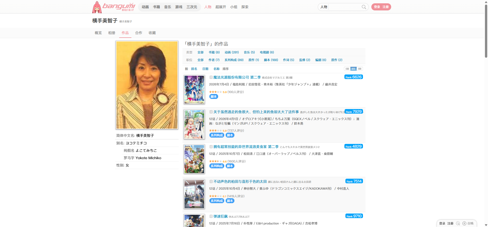
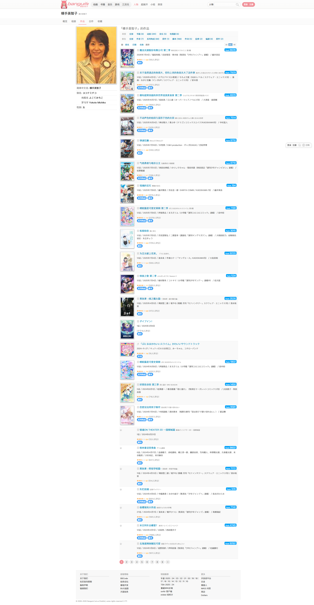
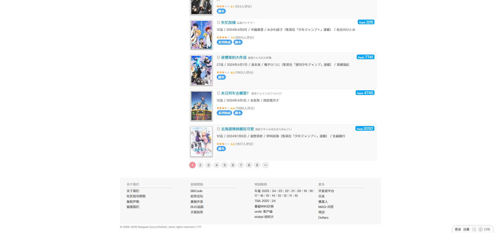

# 横手美智子：作品列表

- 来源：<https://bgm.tv/person/337/works>
- 审计环境：Chrome MCP；隔离上下文 `bangumi-audit-20260814`；页面可用视口 `1920 x 893`，DPR `1`；未登录状态；采集时间 `2026-08-14`。
- 环境：`zh-CN`、`Asia/Shanghai`、`light`；响应式范围：desktop-only（`1920 x 893`），移动与中间视口未审计。
- 覆盖范围：人物头与页签、类型/职位筛选、24 条首分页作品、分页和页脚；封面稳定后的最终文档高度实测 `3664px`。

## Design tokens

| Token | 页面实测值 / 用途 | 证据 |
| --- | --- |
| 主强调色 | 根元素 `--primary-color: #f09199`；用于页面的粉色品牌强调 | 计算样式自定义属性 |
| 正文与链接 | 页面正文为 `400 12px/18px`；作品名链接为 `400 14px/18px`、`rgb(0, 132, 180)` | `.wrapperNeue` 与首项 `h3 a` 计算样式 |
| 筛选表面 | `.subjectFilter` 为 `rgb(250, 250, 250)`，无圆角、无阴影、无边框 | `720 x 61px` 筛选容器计算样式 |
| 列表节律 | `.item` 为 `padding: 7px 5px`、`border-radius: 0px`、无阴影；偶数行 `rgb(249, 249, 249)`，所有行底边为 `1px solid rgb(234, 234, 234)` | 前四条 `.odd` / `.even` 计算样式 |
| 图像栅格 | 条目封面与右侧文本随 `.item` 的固定纵向列表排列；首项外框 `720 x 135px` | `#browserItemList > .item` 实测矩形 |

### Token maturity

- 本页可读取 `3775` 条样式规则，且本次没有不可读取的样式表；该规则数是当前页面的可读取规则计数。
- 作品区中类型、职位、排序与浏览模式均以文本链接呈现，未观察到业务 `Button`、`Checkbox`、`Radio`、`Badge` 或语义 `Table`。顶栏另有一个人物/现实/虚构的原生下拉框、文本输入框与“搜索”按钮，不应视为作品区筛选控件。

## Layout system

- 全局 `.wrapperNeue` 宽 `1905px`、高 `3649px`；主内容 `.columns` 从 `x=453px`、`y=150px` 开始，宽 `1000px`。当前采集的最终文档高度为 `3664px`。
- `.subjectNav` 横跨 `1905px`、高 `41px`；其中 `.navTabs` 为 `display: flex`、`gap: 5px`，宽 `1200px`，承载“概览 / 相册 / 作品 / 合作 / 收藏”的人物上下文。
- 正文以左人物信息轨和右作品轨分栏：标题、筛选和 `#browserItemList` 均位于右侧 `x=718px` 附近；筛选区域位于 `y=190px`，浏览模式位于 `y=262px`，作品列表从 `y=288px` 连续至 `y=3385px`。
- 封面稳定后，作品列表从 `y=288px` 连续至 `y=3385px`，宽 `720px` 且无横向溢出；首分页为 24 个纵向条目。分页位于 `y=3385px`，`#footer` 位于 `y=3453px`、高 `196px`，构成明确的末端区域。

## Reusable components

1. **`.subjectNav` / `.navTabs`**：人物页签导航，当前页面渲染“概览、相册、作品、合作、收藏”；`flex` 行布局保持上下文，而内容区在下方切换。
2. **`.subjectFilter`**：两行文本链接筛选，提供类型（全部、书籍、动画、音乐、电视剧）和职位（作者、系列构成、原作等）切换；这是作品结果集之前的页面级过滤带。
3. **`.browserTypeSelector`**：结果呈现模式链接“精简 / 列表 / 网格”，位于筛选与列表之间，尺寸为 `75 x 20px`。
4. **`#browserItemList.browserFull.browser-list` 与 `.item`**：720px 宽的连续履历结果容器。单项以封面、作品名、原名、排名/元数据、评分与职位顺序展现，使用交替行和细底边区分，不作为 Card 处理。
5. **`.page_inner`**：分页位于结果列表下方，`padding: 10px 0px`，呈现第 1 至 9 页和末页入口。

## Rendered interaction states

| 组件             | 本页实测状态                                 | 触发方式 / 证据                                                  | 未审计状态                         |
| ---------------- | -------------------------------------------- | ---------------------------------------------------------------- | ---------------------------------- |
| `.navTabs a`     | “作品”是当前选中项；其余人物页签为未选中链接 | 当前 URL 为 `/person/337/works`；导航条位于 `y=109px`，高 `41px` | 键盘焦点、悬停和其他页签路由未审计 |
| `.subjectFilter` | 类型与职位筛选链接在默认结果集中同时渲染     | 筛选面板 `720 x 61px`、位于 `y=190px`                            | 改筛选后的结果集和键盘焦点未审计   |
| `.page_inner`    | 首页页码为当前分页状态                       | 默认路由的 24 条结果后，分页位于 `y=3385px`                      | 翻页后的列表和加载状态未审计       |

## Design-system delta

| 项目         | 既有基线                                                        | 本页证据                                              | 结论   | 建议                           |
| ------------ | --------------------------------------------------------------- | ----------------------------------------------------- | ------ | ------------------------------ |
| 主强调色     | [基础组件与共享Tokens](../基础组件与共享Tokens.md) 的 `#f09199` | 人物路由页签选中态与根变量                            | 一致   | 复用                           |
| 浏览列表     | 基线中的连续结果行                                              | `#browserItemList` 宽 `720px`、无横向溢出；偶数行浅灰 | 一致   | 复用                           |
| 两行文本筛选 | 无                                                              | `.subjectFilter` 为无圆角、无阴影的 `720 x 61px` 表面 | 新变体 | 仅作为人物作品页的筛选组合记录 |

- 引用的基线：[基础组件与共享Tokens](../基础组件与共享Tokens.md)。该引用仅用于比较，不表示其所有组件或状态均在本页渲染。

## 页面截图

### 列表底部、分页与页脚

