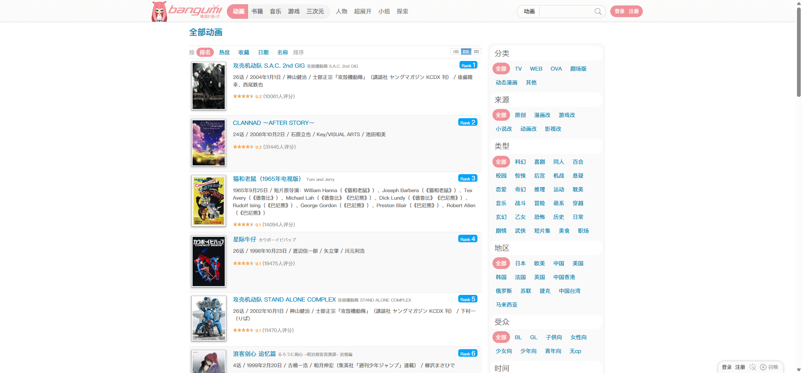
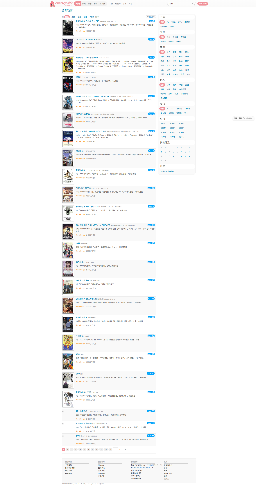

# 全部动画：排名浏览

- 来源：<https://bgm.tv/anime/browser?sort=rank>
- 审计环境：Chrome MCP；隔离上下文 `bangumi-audit-20260814`；页面可用视口 `1920 x 893`，DPR `1`；未登录状态；采集时间 `2026-08-14`。
- 环境：`zh-CN`、`Asia/Shanghai`、`light`；响应式范围：desktop-only（`1920 x 893`），移动与中间视口未审计。
- 覆盖范围：排序控制、首分页条目、筛选侧栏、分页与页脚；最终文档高度实测 `3619px`。

## Design tokens

| Token | 页面实测值 / 用途                                            |
| ----- | ------------------------------------------------------------ |
| 字体  | 全局无衬线字体栈；紧凑的 12px / 18px 信息密度                |
| 色彩  | `#f09199` 全局顶栏；`#0084b4` 链接；`#444` 文本；`#eee` 分隔 |
| 表面  | `#fff` 结果画布；`#fbfbfb` / `#fafafa` 筛选和交替内容表面    |
| 状态  | `.on` 用于当前媒介/筛选状态；条目用 `.odd`、`.even` 交替分组 |

## 细化 Token 与基础组件

- 量化基线：正文 400 / 12px / 18px；列表项 `padding: 7px 5px`、0px 圆角、无阴影；完整数值见 [基础组件与共享Tokens](../基础组件与共享Tokens.md)。
- `Select`：已渲染原生媒介选择器，Arial 400 / 13.333px / normal，49 x 23px，`padding: 4px`，背景 `rgba(255,255,255,.2)`，左圆角 5px、右侧直角。这与页面正文的字体栈不一致。
- `Input` / `Checkbox`：顶栏文本输入为 Arial 400 / 12px / 20px、120 x 20px、`padding: 0 5px`；`.menu-toggle` 为原生 `appearance: auto` 复选框。搜索 submit 为 20 x 17px 的图标型 input，不是通用 Button。
- 已渲染：`Link`、`Navigation`、`Select`、`Input`、`Checkbox`、列表表面与分页。分页 `.p` 为 `#555` on `#eee`、`padding: 4px 10px`、右外边距 4px、50px 圆角；未渲染：`Button`、`Radio`、`Badge`、语义 `Table`、`Tabs`。

## Layout system

- 浏览模板 `.mainWrapper` 实测为 1000px，左边缘 x=453；主列表 700px，右侧栏 280px，间距约 15px。
- 筛选位于结果列表前；作品以连续纵向行而不是响应式卡片网格显示，分页置于底部。

## Reusable components

- `browserTypeSelector`：动画、书籍、游戏、音乐、三次元、人物的媒介切换。
- `filters`：浏览条件、排序和搜索的压缩控制区。
- `browserFull browser-list`：单列、可高密度扫描的搜索结果容器。
- `.item.odd` / `.item.even`：封面、名称、评分、元数据和简介组成的标准条目行。
- `subjectCover coverPortrait`：固定纵向封面比例，防止不同图片扰乱列表节奏。
- 分页数字与 `››` / `›|`：使用文字型页码控制，而非独立卡片按钮。

## Rendered interaction states

| 组件         | 本页实测状态               | 触发方式 / 证据                                     | 未审计状态                         |
| ------------ | -------------------------- | --------------------------------------------------- | ---------------------------------- |
| 排名排序     | 排名是当前结果排序         | URL 查询为 `sort=rank`；列表在 `y=141px` 起连续渲染 | 改变排序后的结果未审计             |
| `.on` 筛选项 | 已渲染当前媒介/筛选状态    | 当前动画浏览路由的筛选区                            | 悬停、键盘焦点及其他筛选组合未审计 |
| 分页         | 首页结果与底部分页同时渲染 | 结果容器高 `3173px`，页脚在 `y=3407px`              | 翻页后的数据和加载状态未审计       |

## Design-system delta

| 项目     | 既有基线                                                          | 本页证据                                              | 结论   | 建议                              |
| -------- | ----------------------------------------------------------------- | ----------------------------------------------------- | ------ | --------------------------------- |
| 结果列表 | [基础组件与共享Tokens](../基础组件与共享Tokens.md) 的连续条目模式 | `.browserFull` 为 `700px` 宽、`3173px` 高，无横向溢出 | 一致   | 复用                              |
| 筛选侧栏 | 无                                                                | 本页实际渲染为主列表旁的条件分组                      | 新变体 | 保持页面级组合，不提升为通用 Card |

- 引用的基线：[基础组件与共享Tokens](../基础组件与共享Tokens.md)。该引用仅用于比较，不表示其所有组件或状态均在本页渲染。
