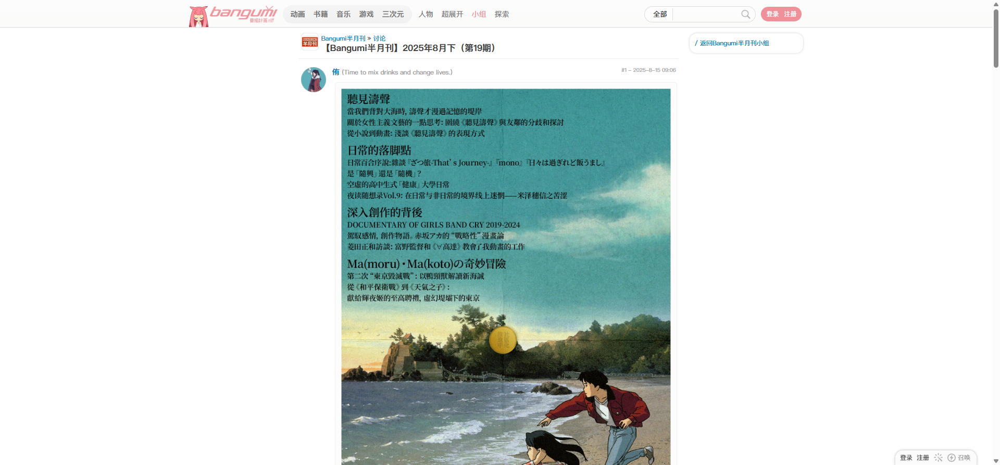
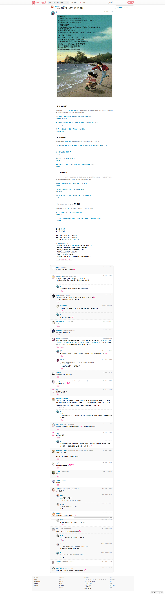
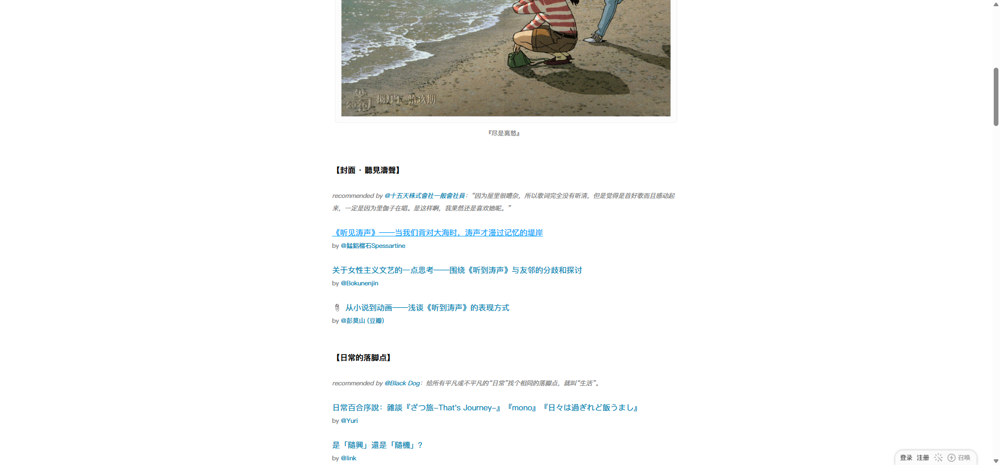
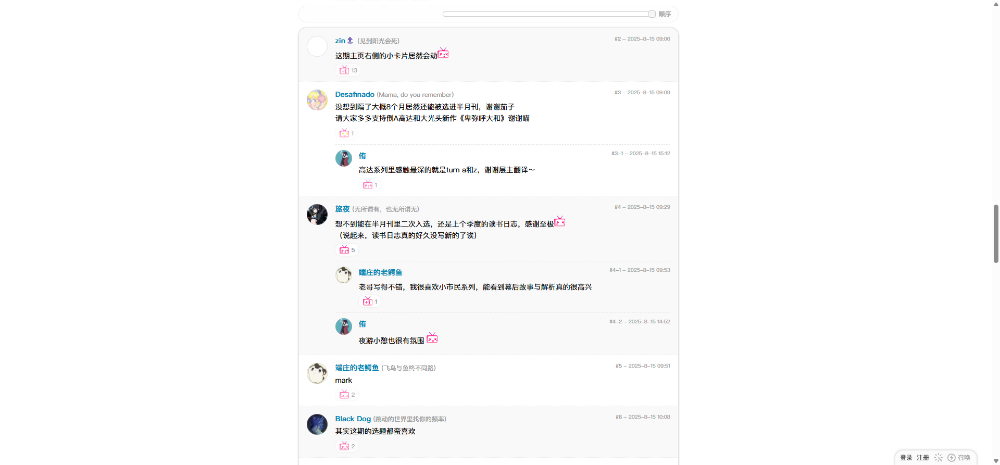
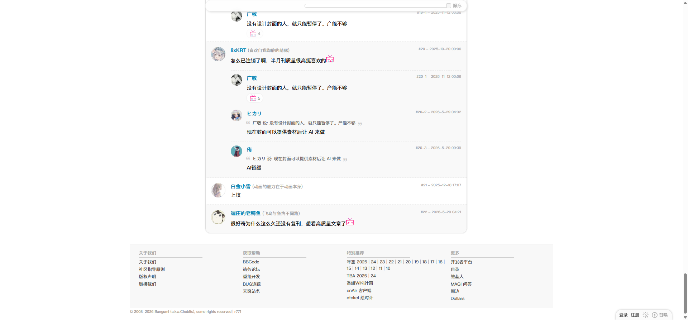

# Bangumi 半月刊主题：第 19 期

- 来源：<https://bgm.tv/group/topic/432006>
- 审计环境：Chrome MCP；隔离上下文 `bangumi-topic-432006-audit-20260814`；窗口 `1920 x 1032`（页面可用视口实测 `1920 x 893`，DPR `1`）；未登录状态；采集时间 `2026-08-14T14:32:00.584Z`。
- 环境：`zh-CN`、`Asia/Shanghai`、`light`；响应式范围：desktop-only，未检查移动端与其他桌面宽度。
- 覆盖范围：全局顶栏、主题首帖、21 条一级回复、8 个嵌套回复、页脚；文档高度实测 `6844px`。滚动至底部后高度未变化。
- 样式表：共 1 份、可读 1 份、不可读 0 份：`https://bgm.tv/css/dist/bangumi.min.css?r771`（`3775` 条规则）。可读规则数不适用下限说明，因为没有不可访问样式表。

## Design tokens

| Token          | 页面实测值 / 用途                                                                                                      | 证据                                 |
| -------------- | ---------------------------------------------------------------------------------------------------------------------- | ------------------------------------ |
| 全局强调色     | 根元素 `--primary-color: #f09199`；顶栏当前“小组”使用粉色                                                              | 已渲染顶栏与根自定义属性             |
| 阅读与回复文字 | `.topic_content` 为 400 / `15px` / `24px`、`rgb(0, 0, 0)`；`.reply_content` 为 400 / `14px` / `22.4px`、`rgb(0, 0, 0)` | 首帖和 21 个一级回复的计算样式       |
| 交互蓝         | 首帖文章链接悬停为 `rgb(2, 163, 251)` 并有下划线                                                                       | “《听见涛声》”链接实测，见悬停截图   |
| 辅助信息       | `.post_actions` 为 400 / `12px` / `18px`、`rgb(170, 170, 170)`                                                         | 楼层号与时间操作区，共 37 处         |
| 回复表面与分隔 | 偶数 `.row_reply` 为 `rgb(249, 249, 249)`；回复间以浅灰细线分隔                                                        | 21 个回复中的 `.light_even` 首个实例 |
| 形状与层级     | `.postTopic` 无边框、`0px` 圆角、无阴影；首个偶数 `.row_reply` 无阴影，顶部圆角 `15px 15px 0px 0px`                    | 首帖及 #2 的计算样式                 |

### Token maturity

- `#f09199`、首帖/回复排印与楼层辅助文字均为本页计算样式证据；它们可作为页面级复现依据，是否提升为全站 token 仍需跨页决策。
- 回复的浅表面和顶部圆角属于本页已渲染的讨论列表变体，不能以共享基线的直角内容面替代。
- 未发现本页内容区投影；`postTopic`、`row_reply`、`topic_sub_reply` 的计算 `box-shadow` 均为 `none`。

## Layout system

- `.mainWrapper` 位于 `x=353, y=53`，宽 `1200px`、高 `6776px`，带 `0 10px` 内边距；主题阅读列的首帖宽 `730px`，右侧仅有“返回 Bangumi 半月刊小组”的轻量链接区域。
- 页面标题从 `y=63` 开始，高 `43px`。首帖 `.postTopic` 从 `y=119` 延至 `y=3011`，其中 `.topic_content` 位于 `x=638, y=148`，宽 `660px`、高 `2825px`；长篇选刊按顺序流式阅读，而非分割为卡片网格。
- 回复从 `y=3054` 开始，一级回复宽约 `728px`。#3、#4、#7、#11、#13、#18、#19、#20 带嵌套回复；`.topic_sub_reply` 宽 `643px`，沿内容列缩进，未创建独立外层 Card。
- 最后一级回复 #22 位于 `y=6522`，页脚从 `y=6632` 开始、高 `196px`。全页截图与底部截图均确认信息流在页脚结束。

## Reusable components

1. **`postTopic`**：主题主帖的作者头像列、作者资料、富文本、`.topic_actions` 和楼层元信息。实测 `padding: 10px 5px`，无阴影；它承载长篇目录、图片、引用和链接。
2. **`topic_content`**：宽 `660px` 的富文本阅读区，实测 `padding: 5px 0 10px`。内容内可见分段标题、站内/站外链接、图片和列表，是首帖内容呈现组件而非通用 Card。
3. **`row_reply` + `reply_content`**：一级楼层的头像列、用户名、正文、反应和 `.post_actions`。第 2 楼等偶数楼层使用 `#f9f9f9` 浅表面，`padding: 15px 15px 10px`；文字内容区保持 `643px` 宽。
4. **`topic_sub_reply` + `sub_reply_bg`**：一级回复中的连续嵌套会话。外层从正文轨道开始，`margin: 10px 0 0`；当前样本无阴影、无独立背景，靠缩进、头像和回复分隔维持层级。
5. **`post_actions` / `topic_actions`**：右侧楼层号和时间使用低对比辅助样式；首帖 `.topic_actions` 宽 `660px`、高 `28px`，不构成独立命令按钮。
6. **全局导航与搜索**：页面顶栏渲染文字导航、类别选择、搜索输入和“搜索”控件；它们属于站点壳层，本次不将其推断为主题帖的业务控件。

### Rendered interaction states

| 组件               | 本页实测状态                                                                     | 触发方式 / 证据                                                                                                  | 未审计状态                                                 |
| ------------------ | -------------------------------------------------------------------------------- | ---------------------------------------------------------------------------------------------------------------- | ---------------------------------------------------------- |
| `.topic_content a` | 默认呈蓝色文章链接；悬停时为 `rgb(2, 163, 251)`、带下划线，400 / `15px` / `24px` | 指针悬停“《听见涛声》——当我们背对大海时，涛声才漫过记忆的堤岸”；悬停后新鲜可访问性快照确认页面仍在该主题，见下图 | 键盘焦点、访问后、禁用与加载状态未在本页触发               |
| `.row_reply`       | 默认连续楼层；奇偶背景交替，嵌套回复以缩进出现                                   | 首屏至 #22 逐段滚动；全页和回复中段截图                                                                          | 回复、点赞及排序的可操作状态在未登录上下文不可完成，未审计 |
| 顶栏搜索           | 默认渲染类别选择、输入框与搜索控件                                               | 首屏可访问性快照含 combobox、textbox、button                                                                     | 输入、提交、错误和焦点状态未审计                           |

## Design-system delta

| 项目           | 既有基线                                                                              | 本页证据                                               | 结论   | 建议                                                      |
| -------------- | ------------------------------------------------------------------------------------- | ------------------------------------------------------ | ------ | --------------------------------------------------------- |
| 首帖富文本排印 | [基础组件与共享Tokens](../基础组件与共享Tokens.md) 的全局正文为 400 / `12px` / `18px` | `.topic_content` 为 400 / `15px` / `24px`              | 新变体 | 在主题/长文富文本组件中单列阅读排印，不覆盖全局正文 token |
| 一级回复排印   | 同基线的全局正文为 `12px` / `18px`                                                    | `.reply_content` 为 400 / `14px` / `22.4px`            | 新变体 | 为讨论回复保留独立的排印层级                              |
| 讨论列表形状   | 基线记录的主要内容容器为 `0px` 圆角                                                   | 偶数 `.row_reply` 实测顶部 `15px 15px 0px 0px`、无阴影 | 新变体 | 将该圆角限定为社区回复列表，不泛化到内容容器              |
| 阴影           | 基线采样表面为 `none`                                                                 | 首帖、回复与嵌套回复均为 `none`                        | 一致   | 延续无投影的连续阅读表面                                  |
| 链接悬停       | 基线仅记录常规链接基色，没有此主题内的悬停测量                                        | 本页文章链接悬停为 `rgb(2, 163, 251)` 且下划线         | 待确认 | 需在其他路由验证后再形成全局 hover token                  |

- 引用的基线：[基础组件与共享Tokens](../基础组件与共享Tokens.md)。该引用仅用于比较，不表示其所有组件或状态均在本页渲染。
- 本页未渲染可用于审计的主题发布表单、业务 Select/Input、Checkbox、Radio、Badge、语义 Table 或主 Tabs；不据此断言这些组件的全站可用性。

## 页面截图

### 回复中段

### 回复底部与页脚

