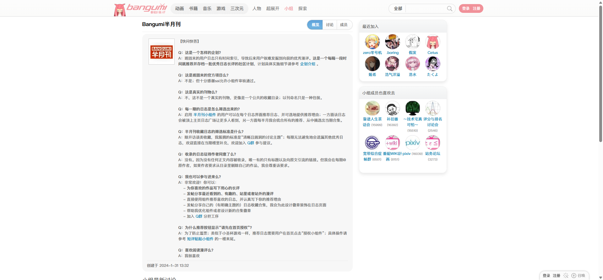
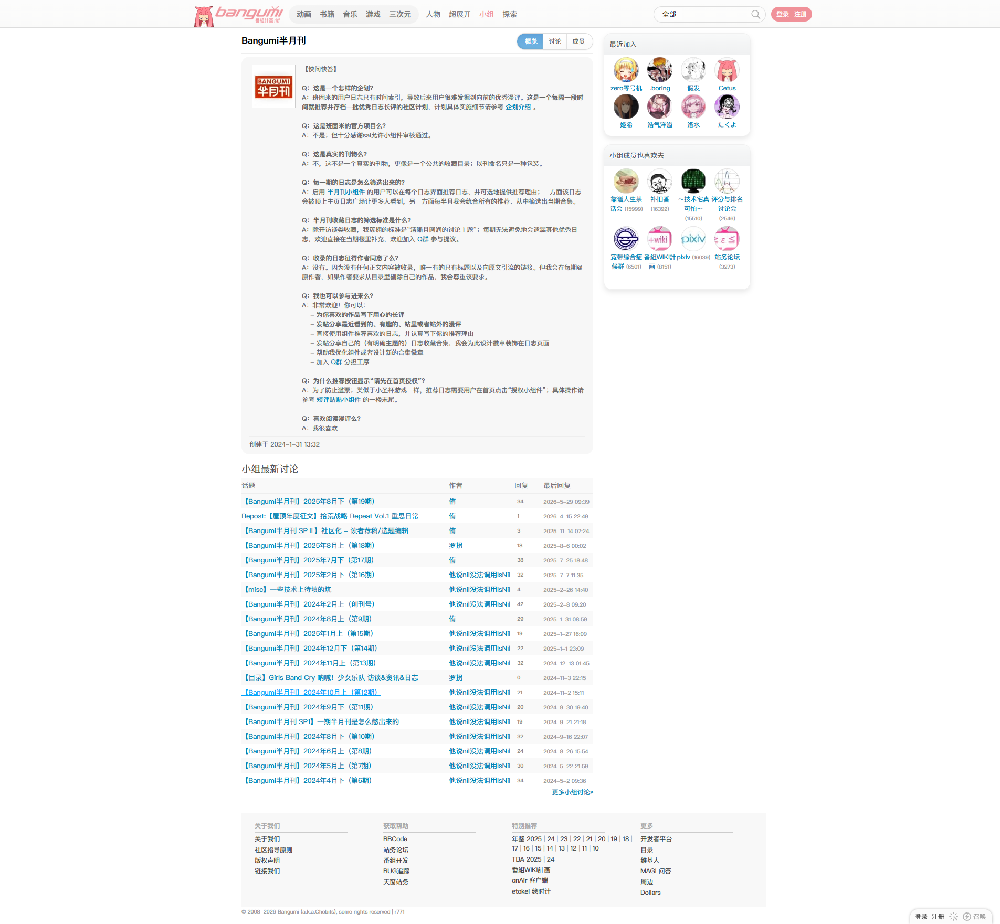
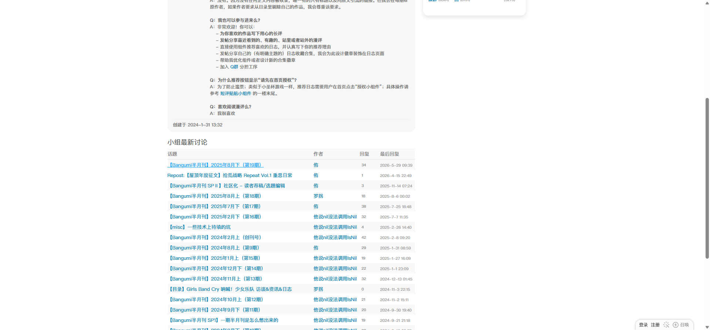
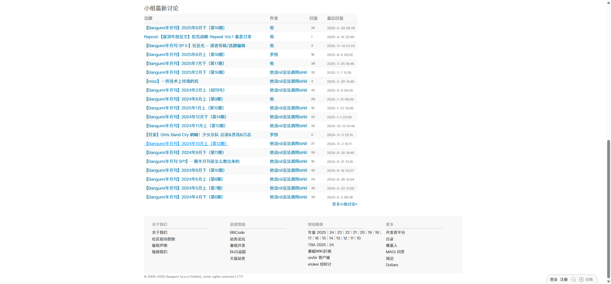

# Bangumi 半月刊小组首页

- 来源：<https://bgm.tv/group/biweekly>
- 审计环境：Chrome MCP；隔离上下文 `bangumi-biweekly-audit-20260814`；浏览器窗口实测 `1914 x 1026`（页面可用视口 `1920 x 893`，DPR `1`）；未登录状态；采集于 `2026-08-14T15:02:40.458Z`。
- 环境：`zh-CN`、`Asia/Shanghai`、`light`；响应式范围：desktop-only（仅 `1920 x 893`，移动端及其他桌面宽度未审计）。
- 覆盖范围：小组页头、FAQ 介绍、最新讨论、两段右侧关系栏和全局页脚；最终文档高度实测 `1761px`，滚至底部后未发生懒加载扩展。

## Design tokens

| Token        | 页面实测值 / 用途                                                                                                | 证据                                                                                             |
| ------------ | ---------------------------------------------------------------------------------------------------------------- | ------------------------------------------------------------------------------------------------ |
| 主强调色     | 根元素自定义属性为 `#f09199`                                                                                     | 页面 `--primary-color`；本页当前小组导航的概览项使用白字，强调色本身未作为该链接的可计算背景暴露 |
| 链接与交互色 | 话题标题默认 `#0084b4`；悬停为 `#02a3fb` 并加下划线                                                              | `.topic_list a`，`400 / 13px / 18px`                                                             |
| 中性色与表面 | 页主表头与 `.topic.even` 为 `rgb(249, 249, 249)`；`.topic.odd` 透明；主列分隔 `.board` 为 `rgb(238, 238, 238)`   | `.topic_list tr`、`.board`                                                                       |
| 排印层级     | 页面正文 `400 / 12px / 18px`；小组名 `700 / 17px / 18px`；侧栏标题 `400 / 13px / 40px`                           | `.mainWrapper`、`h1.SecondaryNavTitle`、`#columnB h2`                                            |
| 形状与层级   | 主列、话题表和侧栏标题为 `0px` 圆角、`none` 阴影；当前“概览”导航是例外，左侧为 `100px 0 0 100px`，有描边与内阴影 | `.topic_list`、`#columnB h2`、`a.selected`                                                       |

### Token maturity

- 页面仅载入一份可读样式表 `https://bgm.tv/css/dist/bangumi.min.css?r771`，共 `3775` 条规则；没有不可读样式表，因此该规则数不是跨源下界。
- `#f09199`、`#0084b4`、`#f9f9f9` 和 `#eee` 均有本页计算样式证据；侧栏图片尺寸未在本次页面中取得有效元素矩形，不能据此确认 `avatarSize48`。

## Layout system

- `.mainWrapper` 位于 `x=453`、宽 `1000px`、高 `1693px`。其中 `.columns` 高 `1476px`，底部预留 `10px`。
- 主列 `#columnA` 位于 `x=453`、宽 `670px`、高 `1456px`；右栏 `#columnB` 位于 `x=1143`、宽 `280px`、高 `504px`，列间距为 `20px`。二者是浮动式并列布局，非 Flex 或 Grid 容器。
- 纵向流程从 `y=63` 的本地导航和 FAQ 开始，`y=881` 为“小组最新讨论”标题，`y=911` 至 `1501` 为 `670 x 590px` 的讨论表，`y=1549` 至 `1745` 为页脚。右栏的“最近加入”和“小组成员也喜欢去”分别从 `y=64`、`y=276` 开始。
- `.topic_list` 是语义 `table`，不是卡片列表：表头高 `29px`；20 条交替话题行从 `y=940` 起，每行 `28px` 或 `29px`。`even` 行为 `#f9f9f9`，`odd` 行透明，形成连续扫描节奏。

## Reusable components

- **`SecondaryNavTitle` 和本地导航**：`h1.SecondaryNavTitle` 为 `670 x 24px`，通过概览、讨论、成员三个相邻链接提供小组上下文；当前概览链接高 `32px`、使用白字、`1px solid #ddd`，并带局部圆角和内阴影。
- **FAQ 介绍正文**：位于主列标题之后、讨论表之前的顺序文本区，承担小组说明，不以通用 Card 表现。
- **`.topic_list` / `.topic.odd` / `.topic.even`**：四列语义表格呈现话题、作者、回复和最后回复。标题链接为 `400 / 13px / 18px`；交替底色属于行变体，而非 Card 状态。
- **`.SidePanel.png_bg.clearit`**：右栏已渲染两段关系型内容，分别显示最近加入成员与成员偏好的小组；本页只确认该容器及其标题，未将其中图片抽象为全局头像尺寸。
- **`#footer`**：`1000 x 196px` 的全局链接与版权区域，属于站点壳层的底部收束，不是小组业务模块。

### Rendered interaction states

| 组件         | 本页实测状态                                                       | 触发方式 / 证据                                | 未审计状态                 |
| ------------ | ------------------------------------------------------------------ | ---------------------------------------------- | -------------------------- |
| 首条话题链接 | 默认 `#0084b4`、无下划线；悬停 `#02a3fb`、`underline`              | 指针悬停 `.topic_list a`；截图见“话题链接悬停” | 键盘焦点、访问后状态       |
| 本地导航     | 概览为当前项，白字、局部胶囊圆角、描边和阴影；讨论和成员为非当前项 | 初始渲染 `a.selected`                          | 非当前项悬停与键盘焦点     |
| 顶栏搜索     | 可见选择框、文本框和“搜索”按钮                                     | 当前未登录静态初始态的可访问性树               | 输入、提交、校验与结果状态 |

## Design-system delta

| 项目         | 既有基线                                       | 本页证据                                             | 结论   | 建议                                             |
| ------------ | ---------------------------------------------- | ---------------------------------------------------- | ------ | ------------------------------------------------ |
| 正文排印     | `400 / 12px / 18px`                            | `.mainWrapper` 同值                                  | 一致   | 复用                                             |
| 小标题排印   | H1 为 `700 / 20px / 26px`                      | `SecondaryNavTitle` 为 `700 / 17px / 18px`           | 新变体 | 作为小组本地标题变体记录，不替换通用 H1          |
| 链接色与悬停 | 主链接 `#0084b4`，普通可点击文字可为 `#0066cc` | 话题链接 `#0084b4`，悬停 `#02a3fb` 加下划线          | 新变体 | 为论坛话题链接保留状态 token，继续在其他路由取证 |
| 内容容器     | 连续列表通常 `0px` 圆角、无阴影                | 话题表和右栏标题同值；当前导航有局部圆角、描边与阴影 | 一致   | 将导航当前项维持为 Navigation 特例               |
| 语义表格     | 基线样本无 `table`                             | 本页 `.topic_list` 是原生 `table`，四列表头与行交替  | 新变体 | 增加论坛话题表组件记录，不泛化为 Card            |

- 引用的基线：[基础组件与共享Tokens](../基础组件与共享Tokens.md)。该引用仅用于比较，不表示其中所有组件或状态均在本页渲染。
- 范围说明：本页没有观测到加入小组动作；未将其列入组件。业务表单控件、分页、弹层及移动布局也未在此页面与视口范围内审计。

## 页面截图

### 话题链接悬停

### 讨论底部与页脚

