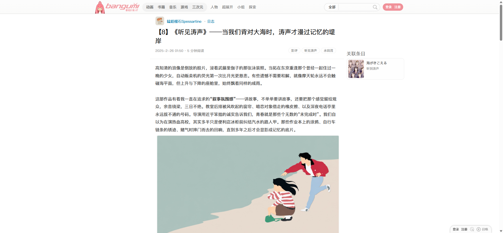
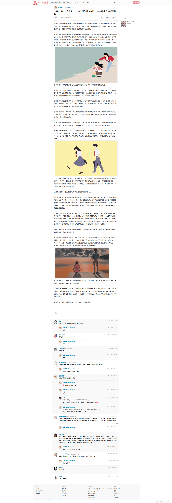
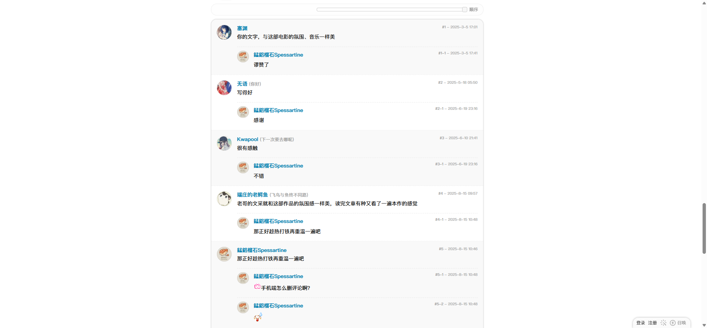
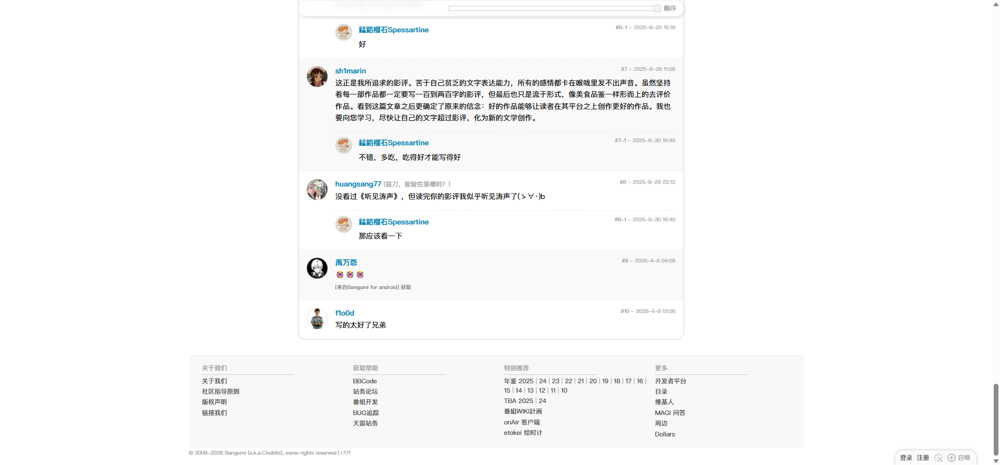

# 日志正文：听见涛声

- 来源：<https://bgm.tv/blog/350740>
- 审计环境：Chrome MCP；隔离上下文 `bangumi-audit-blog-350740-20260814`；页面可用视口实测 `1920 x 893`，DPR `1`；未登录状态；采集日期 `2026-08-14`。
- 环境：`zh-CN`、`Asia/Shanghai`、`light`；响应式范围：`desktop-only`（未检查移动端及其他桌面宽度）。
- 覆盖范围：从顶栏、作者与文章正文，至关联条目、10 条顶级评论、8 条二级回复和页脚；文档高度最终实测 `5540px`，滚动到底后未变化。
- 样式证据：检测到 `1` 张可读样式表、`3775` 条可读规则，未检测到不可读样式表；该规则数为本次页面载入状态的计数。浏览器外层窗口尺寸未由 Chrome MCP 返回，以下尺寸均为页面可用视口及元素实测。

## Design tokens

| Token | 页面实测值 / 用途 | 证据 |
| --- | --- |
| 阅读排印 | `.content` 为 `400 16px/29.6px`，文本 `rgb(51, 51, 51)`；文章 H1 为 `400 24px/33.6px`、`rgb(0, 0, 0)` | `.content` 位于 `x=573, y=226`，宽 `740px`、内边距 `20px`；H1 位于 `x=593, y=106`，宽 `700px` |
| 链接与交互色 | 实测标签链接悬停为 `rgb(2, 163, 251)`，透明背景、无文本装饰、无边框及阴影 | 已触发“影评”标签悬停；截图与无障碍快照见资产目录 |
| 内容表面 | `.entry-container` 透明、无边框、`0px` 圆角、无阴影；评论容器为 `#fff`、`1px solid rgb(223, 223, 223)`、`15px` 圆角与 `0 0 0 2px rgba(0, 0, 0, 0.04)` | `.entry-container` 为 `740 x 3359px`；`.commentList` 为 `740 x 1786px` |
| 回复层级 | 首个 `.row_reply` 背景为 `rgb(249, 249, 249)`，下一行透明；均为 `15px 15px 10px` 内边距 | 首两条回复的绝对 Y 坐标为 `3513px`、`3664px`；不将交替底色泛化为全局页面表面 |

### Token maturity

- 阅读排印及评论面板形状均为本页实测的页面变体，不能仅据此提升为全局 token。
- 标签的默认态和键盘焦点态未在本页完成取证；只记录已触发的悬停态。

## Layout system

- 顶栏下方是 `1180px` 宽的页面框架。主列 `#columnA` 位于 `x=573`，宽 `740px`，从 `y=63` 延伸到 `y=5299`；右侧关联条目 `.entry-related-subjects` 位于 `x=1323, y=193`，宽 `220px`、高 `112px`，而非文章尾部的顺序区段。
- `.entry-container` 覆盖文章区 `y=63` 至 `3422`；正文结束后，`entry-actions` 在 `y=3432`，是 `740 x 28px` 的横向 flex 区；评论在 `y=3512` 至 `5298`，页脚从 `y=5329` 开始、高 `196px`。
- 内容无横向裁切：主列、文章容器和正文的 `scrollWidth` 均等于 `clientWidth`，且 `overflow-x: visible`。本页未观察到可验证的横向滚动带。
- 阅读流由长文主列驱动，关联条目作为首屏右侧补充信息；评论收束为独立面板，回复以头像、内容列、缩进和隔行底色表达层级。

## Reusable components

1. **`entry-container`**：文章标题、作者、元信息、`.content` 与 `entry-actions` 的阅读骨架；它是透明布局容器，而不是视觉 Card。
2. **`.content`**：`740px` 宽的富文本阅读区，以 `20px` 内边距提高长文可读性；当前文章内呈现文字、强调文字和图片。
3. **`.entry-related-subjects`**：右侧关联条目模块，本页仅包含《海がきこえる / 听到涛声》的一个条目链接。
4. **`.commentList.borderNeue`**：白色、圆角、有浅描边和外扩阴影的评论面板；本页含 10 个 `.row_reply` 顶级回复及 8 个 `.topic_sub_reply` 二级回复。
5. **`row_reply`、`reply_content`、`topic_sub_reply`**：评论的重复行、内容列和嵌套回复结构；不是逐条独立卡片。
6. **顶栏搜索表单**：本页渲染原生组合框、文本框和“搜索”按钮；业务表单、主 Tabs、Badge、Radio 与语义 Table 未在本页审计范围内呈现。

### Rendered interaction states

| 组件         | 本页实测状态                                                          | 触发方式 / 证据                                                                                                 | 未审计状态                       |
| ------------ | --------------------------------------------------------------------- | --------------------------------------------------------------------------------------------------------------- | -------------------------------- |
| 日志标签链接 | 默认渲染；“影评”标签悬停后为 `rgb(2, 163, 251)`，无下划线、边框或阴影 | Chrome MCP 悬停；[标签悬停截图](../assets/日志-听见涛声-350740-标签悬停.png) 与 `日志-听见涛声-350740-a11y.txt` | 键盘焦点、禁用和加载状态未呈现   |
| 评论排序控件 | 已渲染“顺序”及横向控件                                                | 位于评论区可视内容；未改变其值                                                                                  | 其他排序值、焦点与禁用状态未呈现 |

## Design-system delta

| 项目         | 既有基线                             | 本页证据                                                          | 结论   | 建议                                             |
| ------------ | ------------------------------------ | ----------------------------------------------------------------- | ------ | ------------------------------------------------ |
| 长文排印     | 基线正文为 `400 12px/18px`           | `.content` 为 `400 16px/29.6px`                                   | 新变体 | 将其保留为日志阅读排印候选，不覆盖全局正文 token |
| 文章 H1      | 基线为 `700 20px/26px`               | 本页 H1 为 `400 24px/33.6px`                                      | 新变体 | 以文章页标题变体记录，继续在其他日志页取证       |
| 内容容器形状 | 基线 Card 为无阴影、`0px` 圆角       | 评论 `.commentList` 为 `15px` 圆角、`#dfdfdf` 边框和 `2px` 浅阴影 | 新变体 | 新增“评论面板”变体，不把它泛化为文章容器         |
| 链接色       | 基线主链接为 `#0084b4`，按上下文可变 | 本页标签悬停为 `rgb(2, 163, 251)`                                 | 待确认 | 作为标签 hover 候选，先补默认态与其他路由证据    |

- 引用的基线：[基础组件与共享Tokens](../基础组件与共享Tokens.md)。该引用仅用于比较，不表示其所有组件或状态均在本页渲染。

## 页面截图

### 标签悬停

### 评论中段

### 底部与页脚

