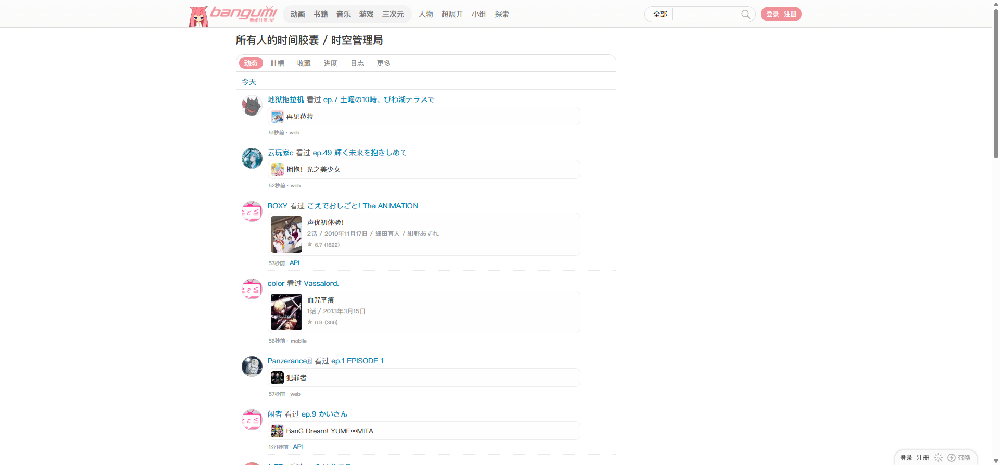
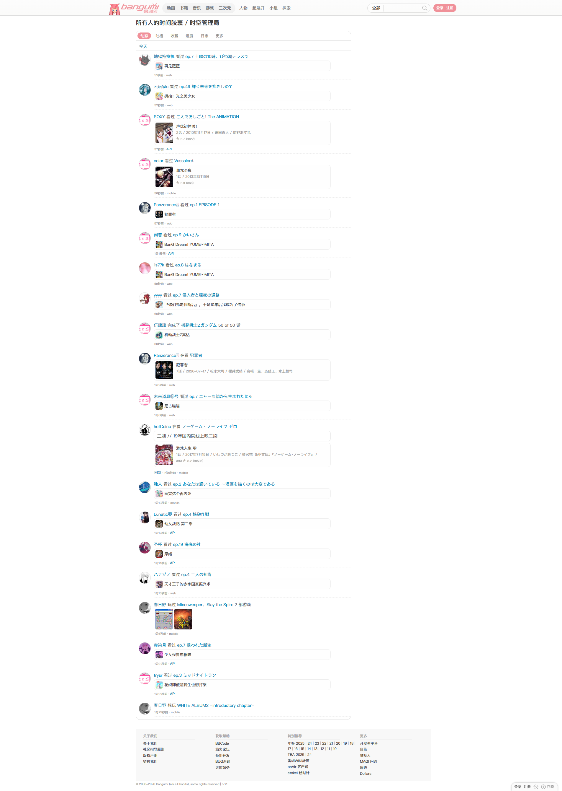
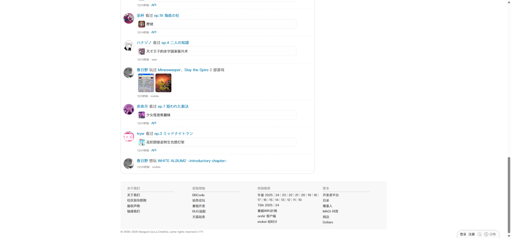
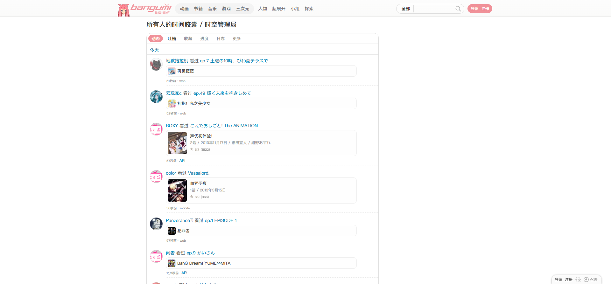

# 所有人的时空管理局

- 来源：<https://bgm.tv/timeline>
- 审计环境：Chrome MCP；隔离上下文 `bangumi-timeline-audit-2026-08-14`；窗口 `1914 x 1026`（页面可用视口实测 `1920 x 893`，DPR `1`）；未登录状态；采集时间 `2026-08-14T15:18:53.535Z`。
- 环境：`zh-CN`、`Asia/Shanghai`、`light`；响应式范围：desktop-only（`1920 x 893`）。未检查其他视口与断点。
- 覆盖范围：标题、筛选 tab、`今天`下的 20 条动态与页脚；文档高度实测 `2678px`。滚至底部后高度未变化。
- 样式表：共 1 份、可读 1 份、不可读 0 份；`https://bgm.tv/css/dist/bangumi.min.css?r771` 可读取 `3775` 条规则。`readableRuleCount` 在出现不可读样式表时仅为下限；本次不存在不可读项。

## Design tokens

| Token        | 页面实测值 / 用途                                                                              | 证据                                          |
| ------------ | ---------------------------------------------------------------------------------------------- | --------------------------------------------- |
| 页面与文字   | `.mainWrapper` 为透明背景、`400 12px/18px`；`#footer` 为 `rgb(170, 170, 170)`                  | `.mainWrapper` 与 `#footer` 的 computed style |
| 选中强调色   | `#f09199`；当前“动态”tab 为白字、粉色背景                                                      | `.timelineTabs a.focus`                       |
| 非选中交互色 | 默认 `#888`，鼠标悬停后为 `#333`，背景保持透明                                                 | “吐槽”tab 的默认与 hover computed style       |
| 标签形状     | 外层 `.timelineTabs` 为 `15px 15px 0 0`；每个 tab 为 `100px` 胶囊圆角                          | `.timelineTabs` 与其链接                      |
| 信息密度     | `.tml_item` 为 `400 12px/18px`、透明、`0px` 圆角、无外阴影；实测高度随内容从 `57px` 到 `190px` | 20 条 `.tml_item` 的首尾与中段测量            |
| 头像与元信息 | 头像 `40 x 40px`、`50%` 圆角、`inset 0 0 2px #bbb`；`.post_actions` 为 `400 10px/18px`、`#999` | `.avatarNeue`、`.post_actions`                |

### Token maturity

- 页面画布、正文排印、粉色强调与低强调元信息均为本页实测；不将未在本页出现的表单或业务控件推断为本页 token。
- 本页存在两个共享基线的页面特例：`.timelineTabs` 有顶部圆角，头像有内阴影；二者不应被概括为全站“直角、无阴影”。

## Layout system

- `.mainWrapper` 从 `x=453px` 开始、宽 `1000px`；时间线主列 `.timelineTabs` / `#timeline` 从 `x=454px` 开始、宽 `728px`，其余宽度保留为空白的右侧区域。
- 页面标题位于 `y=63px`，tab 位于 `y=105px`，`今天`标题位于 `y=148px`。动态从 `y=177px` 到 `y=2431px`，均为顺序阅读流而不是浮层卡片。
- `.tml_item` 为相对定位的 list item，`padding: 5px 0`、`margin: 5px 0`；左侧头像在首项锚定 `x=464px`，正文与操作信息自 `x=514px` 起排布。
- `.post_actions` 是 `display: flex`、`align-items: center`、`gap: 2px` 的低权重行内信息带。页脚从 `y=2467px` 开始，高 `196px`，上外边距 `20px`。

## Reusable components

1. **`.timelineTabs.clearit`**：12 个时间线范围链接组成的筛选带，外层宽 `728px`、高 `33px`，白底且只在上方使用 `15px` 圆角；当前项以 `.focus` 表示。
2. **`.tml_item.clearit`**：重复动态单元。本次有 20 条，结构由 `40px` 发布者头像、活动文字、条目链接和 `.post_actions` 组成；内容多少直接决定 `57px`、`97px`、`132px`、`134px`、`144px` 或 `190px` 的条目高度。
3. **`avatarNeue avatarReSize40`**：固定 `40 x 40px` 头像标识，圆形与轻微内阴影仅记录为头像实例样式。
4. **`.post_actions.date`**：日期与来源的辅助信息，非 Button 或 Badge。
5. **`#footer`**：连续动态结束后的站点级链接与年表带，不是时间线卡片或分页组件。

本页未渲染业务 Button、业务 Input、Radio、通用 Badge 或语义 Table；顶栏出现原生搜索 Select/文本框，但未作为此时间线内容流的业务控件审计。

### Rendered interaction states

| 组件                     | 本页实测状态                                                          | 触发方式 / 证据                                                              | 未审计状态                        |
| ------------------------ | --------------------------------------------------------------------- | ---------------------------------------------------------------------------- | --------------------------------- |
| `.timelineTabs a.focus`  | “动态”已选中：白字、`#f09199` 背景、`100px` 圆角、`padding: 2px 10px` | 初始渲染；[动态选中态截图](../assets/时间线-所有人的时空管理局-动态悬停.png) | 键盘焦点、加载/禁用态未在本轮审计 |
| 非当前 `.timelineTabs a` | 默认透明、`#888`；鼠标悬停“吐槽”后文字为 `#333`，背景仍透明           | 鼠标 hover；[吐槽悬停截图](../assets/时间线-所有人的时空管理局-吐槽悬停.png) | 点击跳转后的筛选结果未检查        |

## Design-system delta

| 项目               | 既有基线                          | 本页证据                                                       | 结论   | 建议                                                    |
| ------------------ | --------------------------------- | -------------------------------------------------------------- | ------ | ------------------------------------------------------- |
| 正文排印与主强调   | 400 / 12px / 18px；`#f09199`      | `.mainWrapper` 及选中 tab 的 computed style                    | 一致   | 复用                                                    |
| Tabs 外框形状      | 基线 `.navTabs` 为 `0px` 圆角     | `.timelineTabs` 为 `15px 15px 0 0`                             | 新变体 | 作为 timelineTabs 页面变体记录，不提升为通用 Tabs token |
| Tab 链接形状和状态 | 基线 Navigation 使用 `100px` 胶囊 | 当前 tab 及非当前 tab 都为 `100px`；选中填充、hover 只变文字色 | 新变体 | 保留为时间线筛选链接的状态规则                          |
| 头像层级           | 基线未定义头像阴影                | `.avatarNeue` 为 `inset 0 0 2px #bbb`                          | 新变体 | 仅在 Avatar 组件有跨页证据后再决定是否通用化            |
| 列表表面           | 基线 Card 为透明、直角、无阴影    | `.tml_item` 与之相符；头像内阴影不属于条目表面                 | 一致   | 复用                                                    |

- 引用的基线：[基础组件与共享Tokens](../基础组件与共享Tokens.md)。该引用仅用于比较，不表示其所有组件或状态均在本页渲染。

## 页面截图

### 底部与页脚

### 交互状态

