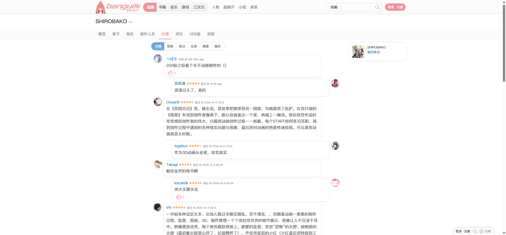
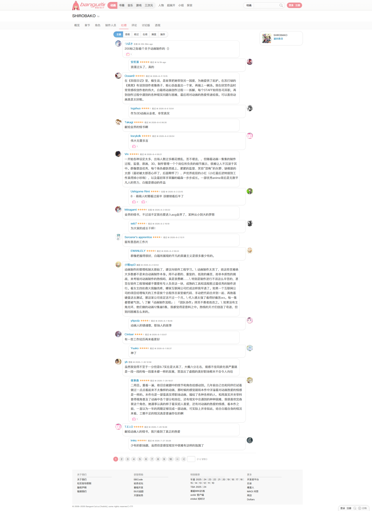
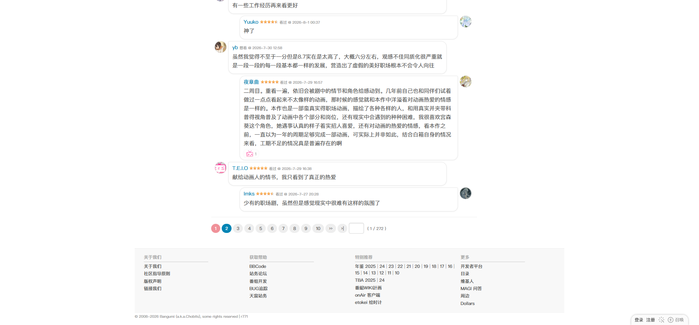

# SHIROBAKO：吐槽

- 来源：<https://bgm.tv/subject/110467/comments>
- 审计环境：Chrome MCP；隔离上下文 `audit-shirobako-comments-20260814`；窗口 `1914 x 1026`（页面可用视口实测 `1920 x 893`，DPR `1`）；未登录状态；采集时间 `2026-08-14T12:42:58.545Z`。
- 环境：`zh-CN`、`Asia/Shanghai`、`light`；响应式范围：`desktop-only`，仅复测 `1920 x 893`，其他视口及断点未审计。
- 覆盖范围：从条目标题、粘性页签到 20 条短评、分页与页脚；文档高度实测 `2614px`，滚动到底后未发生懒加载扩张。
- 样式表：共 `1` 份、可读 `1` 份、不可读 `0` 份；`https://bgm.tv/css/dist/bangumi.min.css?r771` 可读 `3775` 条规则。`readableRuleCount` 为可读规则计数；本页没有不可读样式表，故不构成额外下限限制。

## Design tokens

| Token    | 页面实测值 / 用途                                                                                                             | 证据                                                               |
| -------- | ----------------------------------------------------------------------------------------------------------------------------- | ------------------------------------------------------------------ |
| 全局排印 | `400 12px/18px`，中文无衬线字体栈                                                                                             | `.columns` 的计算样式                                              |
| 短评正文 | `400 15px/24px`、`rgb(85, 85, 85)`；透明、无边框、无阴影、`0px` 圆角、`padding: 2px 0 5px`                                    | 首条 `.comment`                                                    |
| 页签     | 普通链接 `400 14px/18px`、`#888`；当前“吐槽”为 `#f09199`，`padding: 10px 10px 9px`                                            | `.navTabs a` 与 `.navTabs .focus`                                  |
| 分页     | 默认 `#555` / `#eee`，`padding: 4px 10px`、右外边距 `4px`、`50px` 圆角、无阴影；悬停为 `#fff` / `#0084b4`                     | `.page_inner a.p` 的默认与悬停计算样式                             |
| 头像     | `32 x 32px`，右外边距 `5px`；透明、无边框、无圆角、无阴影                                                                     | 首个 `.avatar`                                                     |
| 评论气泡 | `.text` 为 `#fff`、`1px solid #e8e8e8`、`4px 15px 15px` 圆角、`0 1px 3px rgba(0, 0, 0, 0.05)` 阴影，`padding: 5px 5px 0 10px` | 首条 `.text_container .text`                                       |
| 其他表面 | `.subjectNav` 为 `#fbfbfb`；主内容和外层 `.item` 为透明                                                                       | `.subjectNav`、`.content_inner.subject_section` 与 `.item.clearit` |

### Token maturity

- 短评的 `15px/24px` 是本页评论内容变体，不能由全局 `12px/18px` 正文直接替代。
- 评论的白色气泡属于 `.text` 内层；外层 `.item` 透明，不能以任一层的值代替另一层。
- 分页的悬停蓝与默认灰底均由本页实际交互验证；它是链接变体，不是业务 CTA Button。
- 本页未出现业务表单。唯一 `form` 是顶栏搜索，含原生 `select`、文本 `input` 与提交 `input`；不能用它推导评论发表控件的状态。

## Layout system

- `.wrapperNeue` 高 `2599px`，其内 `.columns` 位于 `x=363px`、`y=150px`，宽 `1180px`、高 `2233px`，为横向 flex 且 `align-items: flex-start`。评论主列 `.content_inner.subject_section` 位于 `x=573px`、`y=192px`，宽 `730px`、高 `2126px`。
- `.subjectNav` 位于 `y=109px`，高 `41px`，为 `position: sticky` 的浅色带；内部 `.navTabs` 宽 `1200px`、高 `39px`，横向 flex，`gap: 5px`。其 `scrollWidth` 与 `clientWidth` 均为 `1200px`，本页没有横向滚动证据。
- `.comment-box.comment_box_lr` 位于 `y=207px`，宽 `710px`、高 `2095px`，包裹 20 个 `.item.clearit` 评论行；首三行高度依次为 `88px`、`65px`、`161px`。每行由透明外层、头像和白色 `.text` 气泡构成；它是短评列表容器，不是发表输入区。
- 分页位于 `y=2323px`，高 `50px`；第 1 页是静态文本，2 至 10、下一页和末页为链接。页脚从 `y=2403px` 延续至 `2599px`，形成阅读流的底部收束。

## Reusable components

1. **`subjectNav` / `navTabs`**：条目局部导航；活动项仅以粉色文本表达选择态，没有背景、边框或阴影。
2. **`.content_inner.subject_section`**：宽 `730px` 的短评阅读列，提供主内容的边界与 `10px` 内边距，不是 Card。
3. **`.comment-box.comment_box_lr` + `.item.clearit`**：连续评论流容器与行。每行由透明外层、`32px` 头像及白色 `.text` 气泡组成，气泡包含作者、收藏状态、时间、正文和可选互动计数。
4. **`.comment`**：评论正文的高可读性文本层，较全局正文增大为 `15px/24px`；其父 `.text` 提供本页的气泡边界。
5. **`.page_inner a.p`**：紧凑的分页链接；当前页为文本，其余页保留灰底胶囊和可见悬停反馈。

### Rendered interaction states

| 组件             | 本页实测状态                                                                    | 触发方式 / 证据                                  | 未审计状态                              |
| ---------------- | ------------------------------------------------------------------------------- | ------------------------------------------------ | --------------------------------------- |
| 条目页签         | “吐槽”当前态为 `#f09199`；其他页签默认为 `#888`                                 | URL 与 `.navTabs .focus` 计算样式                | 其他页签的已选态、悬停态未触发          |
| 分页链接         | 默认 `#555` / `#eee`；悬停 `#fff` / `#0084b4`，均为 `50px` 圆角、无阴影         | 对第 2 页链接进行鼠标悬停并读取 `:hover`         | 点击后的第 2 页内容、禁用或加载态未审计 |
| 全局 Logo 链接   | 键盘焦点态显示浏览器默认 `rgb(16, 16, 16) auto 1px` 轮廓，`outline-offset: 1px` | 从页面底部按一次 `Tab`，焦点落在 Logo            | 评论/分页链接的键盘焦点态未逐一抵达     |
| 短评点赞计数链接 | 页面中部分短评呈现可点击计数                                                    | 可访问性树将计数暴露为 `javascript:void(0)` 链接 | 点击后的弹层或名单未触发                |

## Design-system delta

| 项目               | 既有基线                              | 本页证据                                                      | 结论   | 建议                                                         |
| ------------------ | ------------------------------------- | ------------------------------------------------------------- | ------ | ------------------------------------------------------------ |
| 评论文字变体       | 全局正文 `12px/18px`                  | `.comment` 为 `15px/24px`、`#555`                             | 新变体 | 作为短评内容样式保留，不覆盖全局正文 token                   |
| Tabs 当前态        | 当前条目标签使用 `#f09199`            | `.navTabs .focus` 为 `#f09199`，无背景、边框、阴影、圆角      | 一致   | 复用既有 Tabs 规则                                           |
| 分页链接           | 分页默认 `#555` / `#eee`、`50px` 圆角 | `.page_inner a.p` 默认值一致；本页补充测得悬停 `#0084b4/#fff` | 一致   | 复用默认值，并将悬停值作为已验证交互态记录                   |
| `comment-box` 归属 | 无针对该类的共享组件断言              | 本页为 20 行评论的列表容器，无评论发表表单                    | 冲突   | 修正页面审计中的“输入入口”描述，不新增 Textarea/Button token |
| 评论气泡           | 标准列表采用连续表面、无阴影          | `.text` 有白底、`1px #e8e8e8` 边框、不对称圆角和轻阴影        | 新变体 | 将其限定为短评气泡变体，不推广为通用 Card                    |

- 引用的基线：[基础组件与共享Tokens](../基础组件与共享Tokens.md)。该引用仅用于比较，不表示其所有组件或状态均在本页渲染。

## 页面截图

### 分页与页脚

