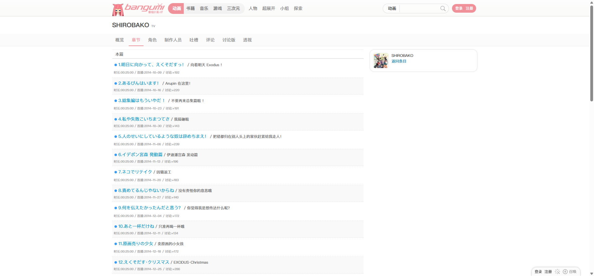
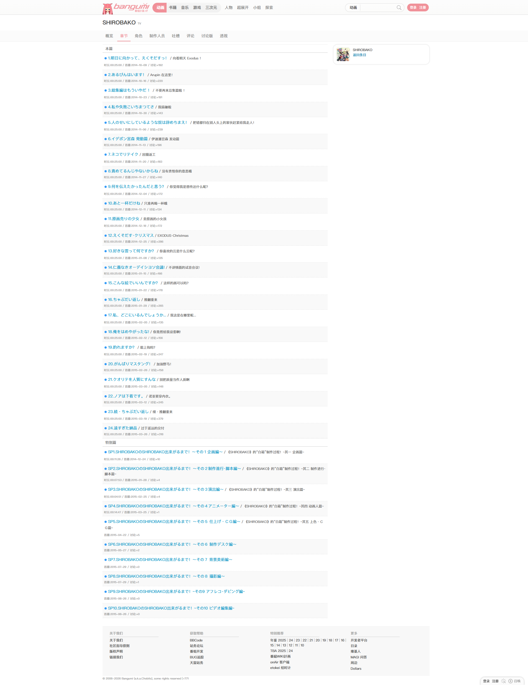
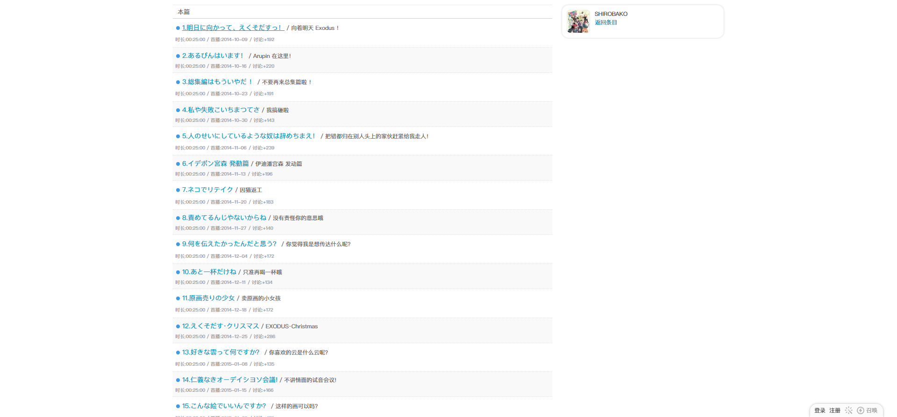
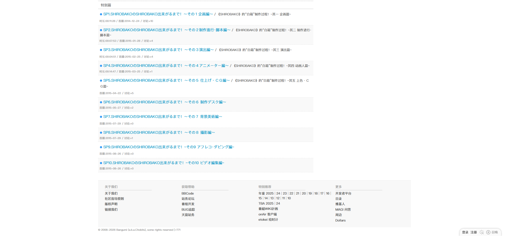

# SHIROBAKO：章节列表

- 来源：<https://bgm.tv/subject/110467/ep>
- 审计环境：Chrome MCP；隔离上下文 `chapter-list-audit-20260814`；窗口 `1920 x 1032`（页面可用视口实测 `1920 x 893`，DPR `1`）；未登录；采集于 `2026-08-14T13:11:55.418Z`。
- 环境：`zh-CN`、`Asia/Shanghai`、`light`；响应式范围：desktop-only（`1920 x 893`），其他视口未审计。
- 覆盖范围：从全局顶栏、条目标题与页签，到“本篇”及 SP10 的全部章节行、页脚；文档高度实测 `2468px`，滚至底部后未变化。
- 样式表：共 `1` 个，均可读（`https://bgm.tv/css/dist/bangumi.min.css?r771`），共 `3775` 条规则；本页没有不可读样式表，因此该规则数不是受跨域限制的下界。

## Design tokens

| Token          | 页面实测值 / 用途                                                                                    | 证据                                                                               |
| -------------- | ---------------------------------------------------------------------------------------------------- | ---------------------------------------------------------------------------------- |
| 主强调色       | `#f09199`                                                                                            | `:root` 的 `--primary-color`；当前 `.navTabs .focus` 文本为 `rgb(240, 145, 153)`。 |
| 章节链接与状态 | `rgb(0, 153, 204)`                                                                                   | `.line_list a` 与 `.epAirStatus`；“已放送”状态由带描述的内联元素及相同蓝色承载。   |
| 表面           | 章节奇数行为 `#fff`，偶数行为 `#f9f9f9`                                                              | `.line_odd` / `.line_even`，无显式边框、无阴影。                                   |
| 排印           | 页面正文 `400 / 12px / 18px`；章节行 `400 / 14px / 18px` 或换行后的 `22.4px`；H1 `700 / 20px / 26px` | `.wrapperNeue`、`.line_list > li`、`h1.nameSingle` 的计算样式。                    |
| 形状与层级     | 主内容、章节行和 tabs 均为 `0px` 圆角、`none` 阴影                                                   | `.columns`、`.line_list`、`.navTabs` 的计算样式。                                  |

### Token maturity

- 上表仅记录本页实测值；章节行的 `14px` 排印和 `#f9f9f9` 交错表面是此页面的列表变体，不能仅凭一个路由升级为全局 token。
- 可读 CSS 规则可供追溯，但本报告的尺寸、颜色与状态以当前 DOM 的计算样式为准。

## Layout system

- `.subjectNav` 位于绝对 `y=109`，高 `41px`，`position: sticky`；其中 `.navTabs` 宽 `1200px`、高 `39px`，以水平 flex（`gap: 5px`）承载八个条目内页签。
- `.columns` 从 `y=150` 至 `2237`，宽 `1180px`、`display: flex`；`#columnInSubjectA` 为 `812px` 的章节主列，`#columnInSubjectB` 为 `348px` 侧列，首屏包含“SHIROBAKO / 返回条目”上下文模块。
- `.line_list` 与该单列同宽，从 `y=160` 至 `2227`。`本篇` 类别行高 `30px`，随后章节行以 `#fff` / `#f9f9f9` 交错，单行高度约 `53px`，换行时 `62px`；横向 `clientWidth` 与 `scrollWidth` 均为 `812px`，没有横向滚动处理。
- 章节表结束后，页脚从 `y=2257` 开始、高 `196px`；信息流是从标题、局部导航到连续章节清单和全局页脚的顺序阅读，而非卡片或语义表格布局。

## Reusable components

1. **`h1.nameSingle`**：`SHIROBAKO TV` 的页面身份标题，宽 `1200px`，内边距 `0 10px`，维持条目上下文。
2. **`subjectNav` / `.navTabs`**：条目内导航；每个标签采用 `400 / 14px / 18px` 与 `padding: 10px 10px 9px`，当前“章节”以主强调色区分，而非用表面或边框选中。
3. **`.line_list`**：连续 `li` 清单，不是 Card 或语义 `table`。每项以编号、日文标题、中文标题、时长/首播与讨论数组织为可横向扫描的文本序列。
4. **章节 `Link` 与 `.epAirStatus`**：章节标题为内联链接；“已放送”暴露为带无障碍描述的状态元素，视觉上不使用额外色块。
5. **顶栏搜索**：本页实际渲染选择框、文本框和“搜索”按钮；它们属于全局顶栏，不应视为章节列表的业务表单控件。

### Rendered interaction states

| 组件           | 本页实测状态                                                                       | 触发方式 / 证据                                       | 未审计状态                                    |
| -------------- | ---------------------------------------------------------------------------------- | ----------------------------------------------------- | --------------------------------------------- |
| 当前章节 tab   | selected；`#f09199`、透明背景、无边框/阴影                                         | 当前路由的 `.navTabs .focus` 为“章节”。               | 其他 tab 的 hover、焦点与路由切换结果未审计。 |
| 章节链接       | 默认蓝色；hover 后增加 `underline`，色值仍为 `rgb(0, 153, 204)`，`cursor: pointer` | 悬停首章链接后复测 `.line_list a:hover`；见下方截图。 | 已访问态、加载或错误态未在本页触发。          |
| 全局 Logo 链接 | 键盘焦点呈 `rgb(16, 16, 16) auto 1px` 轮廓，`outline-offset: 1px`                  | 自页面按 `Tab` 后，焦点落在“Bangumi 番组计划”链接。   | 章节链接的键盘焦点未逐项遍历。                |
| `.epAirStatus` | 已放送                                                                             | 当前全部检查样本都具有“已放送”无障碍描述。            | 未播出、延期或禁用状态未在本页出现。          |

## Design-system delta

| 项目       | 既有基线                                                            | 本页证据                                                                                 | 结论   | 建议                                                   |
| ---------- | ------------------------------------------------------------------- | ---------------------------------------------------------------------------------------- | ------ | ------------------------------------------------------ |
| 当前页签   | `Tabs` 为 `14px / 18px`、`padding: 10px 10px 9px`、强调色 `#f09199` | `.navTabs .focus` 与基线值一致。                                                         | 一致   | 复用。                                                 |
| 连续列表   | 基线的标准 `.item` 记录为 `12px / 18px` 与 `7px 5px`                | 本页 `.line_list > li` 为 `14px`、`padding: 6px 5px`，并有 `#fff` / `#f9f9f9` 交错表面。 | 新变体 | 将其记录为章节清单变体，继续在其他章节页取证后再泛化。 |
| 链接 hover | 基线仅描述默认链接语义色                                            | 本页章节链接 hover 仅增加下划线，颜色不变。                                              | 待确认 | 作为本页证据保留，尚不设为全局 hover 规则。            |
| 表格与卡片 | 基线指出标准列表无卡片化且未见语义 table                            | 本页是连续 `li`，无语义 `table`、无阴影、无圆角。                                        | 一致   | 复用连续列表表达，不引入 Card。                        |

- 引用的基线：[基础组件与共享Tokens](../基础组件与共享Tokens.md)。该引用仅用于比较，不表示其所有组件或状态均在本页渲染。
- 范围说明：本页未见章节业务 `Button`、`Checkbox`、`Radio`、`Badge` 或语义 `table`；顶栏搜索控件已渲染，但不归入章节业务控件。

## 页面截图

### 章节链接悬停

### 列表底部与页脚

