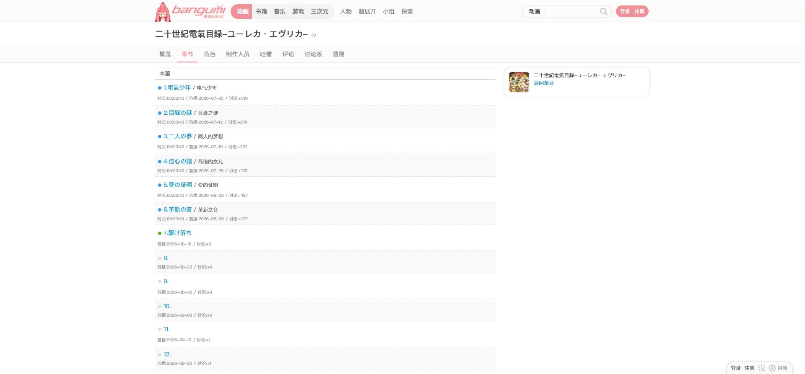
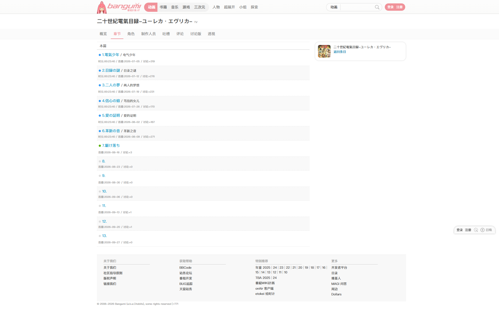

# 二十世紀電氣目録-ユーレカ・エヴリカ-：章节列表

- 来源：<https://bgm.tv/subject/255209/ep>；从用户提供的条目页 `https://bgm.tv/subject/255209` 中的“章节”导航进入。
- 审计环境：Chrome MCP；隔离上下文 `episode-status-255209-audit`；窗口与页面可用视口均为 `1920 x 893`，DPR `1`；未登录；采集于 `2026-08-15`。
- 环境：`zh-CN`、`Asia/Shanghai`、`light`；响应式范围：desktop-only（`1920 x 893`）。
- 覆盖范围：从条目标题与本地导航到全部 13 个章节行及页脚；文档高度实测 `1185px`。目标页同时渲染 6 个已放送、1 个放送中和 6 个未放送章节。
- 样式表：共 `1` 个可读样式表（`https://bgm.tv/css/dist/bangumi.min.css?r771`），含 `3775` 条规则。

## Design tokens

| Token      | 页面实测值 / 用途                                                           | 证据                                                   |
| ---------- | --------------------------------------------------------------------------- | ------------------------------------------------------ |
| 主强调色   | `#f09199`                                                                   | `:root` 的 `--primary-color`；当前“章节”页签使用该色。 |
| 章节链接   | `rgb(0, 153, 204)` / `#0099cc`                                              | 全部章节标题链接，包括未放送章节，均为该颜色。         |
| 已放送状态 | `title="已放送"`；`.Air` 为 `8 x 8px`、背景 `rgb(54, 156, 248)` / `#369cf8` | 第 1 至 6 集的 `.epAirStatus > .Air`。                 |
| 放送中状态 | `title="放送中"`；`.Today` 为 `8 x 8px`、背景 `rgb(85, 177, 0)` / `#55b100` | 第 7 集的 `.epAirStatus > .Today`。                    |
| 未放送状态 | `title="未放送"`；`.NA` 为 `8 x 8px`、背景 `rgb(221, 221, 221)` / `#dddddd` | 第 8 至 13 集的 `.epAirStatus > .NA`。                 |
| 次级元信息 | `rgb(153, 153, 153)` / `#999`                                               | 时长、首播日期、讨论数的 `small.grey`。                |
| 表面       | 奇数行 `#fff`，偶数行 `#f9f9f9`                                             | `.line_odd` / `.line_even`。                           |
| 排印       | 章节链接与状态容器 `400 / 14px / 18px` 或换行后的 `22.4px`                  | `h6 a` 与 `.epAirStatus` 的计算样式。                  |

### Token maturity

- 本页证明放送状态并非与章节链接共用同一视觉值：链接固定为 `#0099cc`，状态由带 `title` 的 `8px` 圆点表达。
- 已放送的状态容器文本色同样继承 `#0099cc`，但其实际可见信号是 `.Air` 的 `#369cf8` 背景；不能将容器的前景色误记为状态色。
- `#55b100` 与 `#dddddd` 目前仅在此条目页取证，尚不足以直接升级为全局 `success` 或禁用 token 映射。

## Layout system

- `.columns` 从 `y=150` 开始，宽 `1180px`、高 `803px`，为横向 flex；章节主列 `.line_list` 宽 `812px`、高 `783px`，无横向滚动（`clientWidth = scrollWidth = 812px`）。
- `.line_list` 为连续 `li` 信息流：类别行“本篇”高 `30px`；章节行按奇偶交替背景，标题、译名、时长、首播和讨论数顺序排列。
- 本页未显示 Card 外框、阴影或圆角；状态点位于章节标题前，依靠 `title` 提供状态文字，页面正文不额外显示“已放送 / 放送中 / 未放送”标签。

## Reusable components

1. **`.line_list` 章节行**：章节标题是链接，译名使用 `.tip`，时长、首播与讨论数使用 `.grey` 元信息；行本身不是 Card 或语义表格。
2. **`.epAirStatus`**：章节标题前的内联状态容器，携带 `title`；子元素按 `Air`、`Today`、`NA` 切换为蓝、绿、灰 `8px` 状态点。
3. **章节标题链接**：各放送状态下都保持 `#0099cc`，可跳转性与生命周期状态没有耦合。

### Rendered interaction states

| 组件           | 本页实测状态                                               | 触发方式 / 证据                                                                              | 未审计状态                         |
| -------------- | ---------------------------------------------------------- | -------------------------------------------------------------------------------------------- | ---------------------------------- |
| `.epAirStatus` | 已放送、放送中、未放送                                     | 页面初始渲染；`title` 分别为“已放送”“放送中”“未放送”，子元素 class 为 `Air`、`Today`、`NA`。 | 延期、取消、未知状态；本页未渲染。 |
| 章节链接       | 三种放送状态下都为默认 `#0099cc`；hover 后颜色与装饰均不变 | 第 1、7、8 集标题链接的计算样式一致；悬停第 1 集后仍为 `#0099cc`、`text-decoration: none`。  | 键盘 focus、visited。              |
| 当前章节页签   | 当前态，粉色文字                                           | 初始路由为 `/ep`，本地导航的“章节”为当前项。                                                 | 其他页签 hover 与 keyboard focus。 |

## Design-system delta

| 项目         | 既有基线                                                     | 本页证据                                           | 结论   | 建议                                                                       |
| ------------ | ------------------------------------------------------------ | -------------------------------------------------- | ------ | -------------------------------------------------------------------------- |
| 章节标题链接 | [章节列表-SHIROBAKO](章节列表-SHIROBAKO.md) 记录为 `#0099cc` | 已放送、放送中、未放送章节标题都为 `#0099cc`。     | 一致   | 使用通用 `link` 语义；不为章节标题直引 raw 色板。                          |
| 已放送状态   | 基线只审计到已放送                                           | `.Air` 为蓝色 `#369cf8` 点，带“已放送” `title`。   | 一致   | 作为章节状态组件的已放送变体继续取证。                                     |
| 放送中状态   | 无                                                           | `.Today` 为绿色 `#55b100` 点，带“放送中” `title`。 | 新变体 | 先定义为章节组件状态；后续比较其他页面后再决定是否映射通用状态色。         |
| 未放送状态   | 无                                                           | `.NA` 为灰色 `#dddddd` 点，带“未放送” `title`。    | 新变体 | 先定义为章节组件状态；不能直接视作 `text.disabled`，因为标题链接仍可操作。 |

- 引用的基线：[基础组件与共享Tokens](../基础组件与共享Tokens.md) 与 [SHIROBAKO 章节列表](章节列表-SHIROBAKO.md)。这些基线用于比较，不表示其未审计状态已在该页面渲染。

## 页面截图

### 三种放送状态

