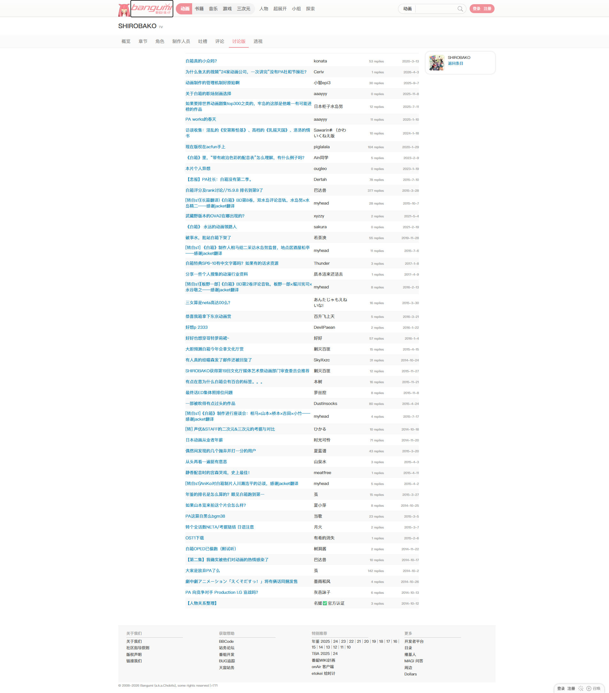
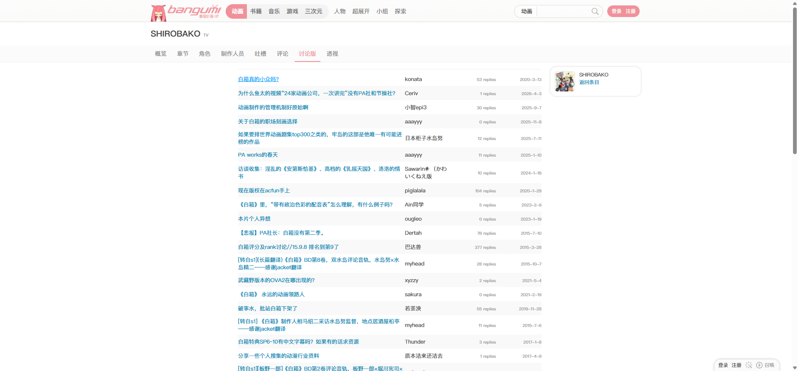
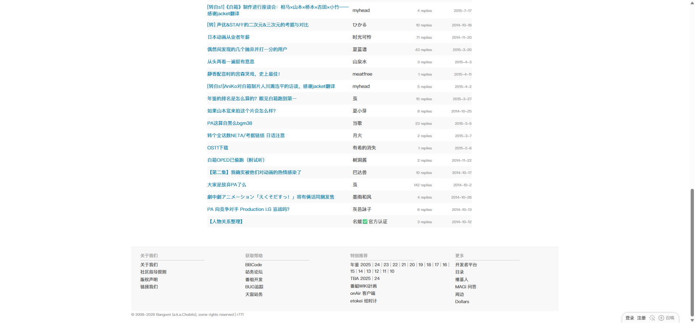

# SHIROBAKO：讨论版

- 来源：<https://bgm.tv/subject/110467/board>
- 审计环境：Chrome MCP；隔离上下文 `bangumi-audit-discussion-shirobako-20260814`；窗口实测 `1914 x 1026`（页面可用视口 `1920 x 893`，DPR `1`）；未登录状态；采集时间 `2026-08-14T12:54:36.004Z`。
- 环境：`zh-CN`、`Asia/Shanghai`、`light`；响应式范围：`desktop-only`，仅检查 `1920 x 893`，其他视口与断点未审计。
- 覆盖范围：从顶栏、条目页签、48 行讨论主题到页面底部页脚；文档高度实测 `2165px`。加载与滚动后高度未变化。
- 样式表：共 `1` 张、均可读；`https://bgm.tv/css/dist/bangumi.min.css?r771` 含 `3775` 条 CSS 规则。`readableRuleCount` 为可读规则计数；本页没有不可读样式表，因此不是下限估计。

## Design tokens

| Token        | 页面实测值 / 用途                                                                | 证据                                                     |
| ------------ | -------------------------------------------------------------------------------- | -------------------------------------------------------- |
| 主强调色     | `#f09199`；当前 `.navTabs a.focus` 的文字色                                      | 讨论版标签为 `400 14px/18px`，`padding: 10px 10px 9px`   |
| 主题链接     | 默认 `#0084b4`；悬停为 `#02a3fb` 并显示下划线                                    | 首行 `.topic_list tr:first-child a.l` 为 `400 13px/18px` |
| 作者与元信息 | 作者链接 `#444`；回复数与日期 `.grey` 为 `#999`、`400 10px/10px`                 | 首行的作者、回复数与日期单元格                           |
| 中性色与表面 | 页面背景白色；`.subjectNav` 为 `#fbfbfb`；偶数主题行 `#f9f9f9`，奇数行透明       | `table.topic_list` 内 `tr.even` / `tr.odd` 的计算样式    |
| 排印层级     | H1 为 `700 20px/26px`；列表为 `400 13px/18px`；全局正文为 `400 12px/18px`        | `h1.nameSingle`、`.topic_list`、`.columns`               |
| 形状与层级   | 列表和页签均无阴影；`.topic_list` 为 `0px` 圆角；偶数 `tr` 为页面特有 `5px` 圆角 | `.topic_list`、`tr.even` 的计算样式                      |

### Token maturity

- `#f09199`、`#0084b4`、`#444`、`#999` 与 [基础组件与共享Tokens](../基础组件与共享Tokens.md) 的已测颜色一致；本页只为现有 token 提供路由级证据，不据此新增全局 token。
- `tr.even` 的 `#f9f9f9` 与 `5px` 圆角仅在本页的交替主题行中实测，应先作为讨论列表变体，不应直接推广为通用 Card 规范。

## Layout system

- 全局顶栏内层 `.headerNeueInner` 位于 `x=353px`，宽 `1200px`、高 `52px`，为不换行的 flex 行；条目标题位于 `y=68px`，条目页签位于 `y=110px`。
- `.subjectNav` 横跨可见文档宽度 `1905px`，高 `41px`，`position: sticky`，背景 `#fbfbfb`。其中 `.navTabs` 以 `5px` gap 在居中的 `1200px` 内排列。
- 主体 `.columns` 从 `y=150px` 起，宽 `1180px`、高 `1784px`，为不换行 flex 容器；讨论表位于 `x=573px`，宽 `730px`。右侧仅渲染了带条目封面和“返回条目”链接的关联条目上下文。
- `table.topic_list` 高 `1728px`，含 `48` 个 `tr`。每行高 `34px`、四列依次承载主题、作者、回复数、日期；主题列宽 `402px`，后三列各 `110px`。这是语义 table，而非连续卡片或行内头像列表。
- 最后一行位于 `y=1867px`；页脚 `#footer` 从 `y=1954px` 至 `2150px`，高 `196px`。主题列表和主列均为 `overflow: visible`，`scrollWidth` 等于 `clientWidth`，本页未观察到横向滚动处理。

## Reusable components

1. **条目页签 `.subjectNav` / `.navTabs`**：在 8 个条目路由间定位；普通标签与当前标签都无背景、边框或阴影，当前状态由粉色文本区分。
2. **讨论主题表 `table.topic_list`**：四列、48 行的语义表格。首列 `.subject > a.l` 是蓝色主题链接；作者是 `#444` 文字链接；回复数与日期为右对齐的弱元信息。交替浅表面帮助纵向扫描，不构成独立 Card。
3. **顶栏搜索组合**：本页可访问性树中渲染原生 `combobox`、`textbox` 与“搜索”`button`；它属于全局顶栏，不是讨论列表业务控件。
4. **页脚 `#footer`**：四组文字链接与版权行，使用 `#aaa` 低强调色，作为全站底部导航而非讨论板组件。

本页未渲染讨论主题作者/最后回复者头像，也没有分页、发帖按钮、业务表单控件、Badge 或对话框；这些结论仅限当前未登录讨论版，不能推断到其他路由或登录状态。

## Rendered interaction states

| 组件                        | 本页实测状态                                                 | 触发方式 / 证据                                                           | 未审计状态                               |
| --------------------------- | ------------------------------------------------------------ | ------------------------------------------------------------------------- | ---------------------------------------- |
| 主题链接 `.topic_list a.l`  | 默认 `#0084b4`；悬停 `#02a3fb`、带下划线                     | 鼠标悬停首行“白箱真的小众吗?”后读取计算样式；见下方悬停截图               | 访问后、禁用、加载与错误状态未在本页触发 |
| 顶栏 Logo 链接              | 键盘焦点显示浏览器 `1px auto` outline，`outline-offset: 1px` | 页面初始状态按一次 `Tab` 后焦点落于“Bangumi 番组计划”；随后刷新 a11y 快照 | 其他链接的键盘焦点与菜单展开未逐一审计   |
| 当前页签 `.navTabs a.focus` | 已选中视觉状态：`#f09199` 文本；无填充、边框或阴影           | 当前 URL 为 `/subject/110467/board`，元素计算样式与页面导航一致           | 其他页签的当前状态需在对应路由审计       |

## Design-system delta

| 项目         | 既有基线                                                | 本页证据                                                                     | 结论   | 建议                                                     |
| ------------ | ------------------------------------------------------- | ---------------------------------------------------------------------------- | ------ | -------------------------------------------------------- |
| 当前条目页签 | `.focus` 使用 `#f09199`，`14px/18px` 与 `10px 10px 9px` | `.navTabs a.focus` 的实测值相同                                              | 一致   | 复用                                                     |
| 标准链接语义 | 常规链接可用 `#0084b4` 或 `#444`，按上下文区分          | 主题为 `#0084b4`，作者为 `#444`；主题 hover 为额外实测 `#02a3fb` + underline | 一致   | 复用颜色上下文；记录 hover 作为 Link 状态证据            |
| Card         | 基线的 `.item` 为直角、无阴影的连续列表表面             | 讨论列表实际为 `table`；偶数 `tr` 有 `#f9f9f9` 和 `5px` 圆角                 | 新变体 | 将其限定为 `topic_list` 的斑马行变体，不升级为通用 Card  |
| Table        | 基线样本未渲染语义 `table`                              | 本页 `table.topic_list` 有 48 行、四列与表格显示模型                         | 新变体 | 新增“论坛主题表”组件记录，并保留本页尺寸与列语义         |
| 头像         | 基线提及其他页面的头像样本                              | 本页主题行中未渲染用户头像；右侧仅为关联条目封面                             | 待确认 | 不把头像纳入本页讨论行组件；在实际渲染头像的路由单独取证 |

- 引用的基线：[基础组件与共享Tokens](../基础组件与共享Tokens.md)。该引用仅用于比较，不表示其所有组件或状态均在本页渲染。

## 页面截图

### 主题链接悬停

### 列表底部与页脚

