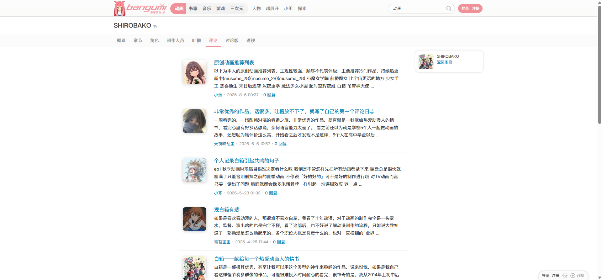
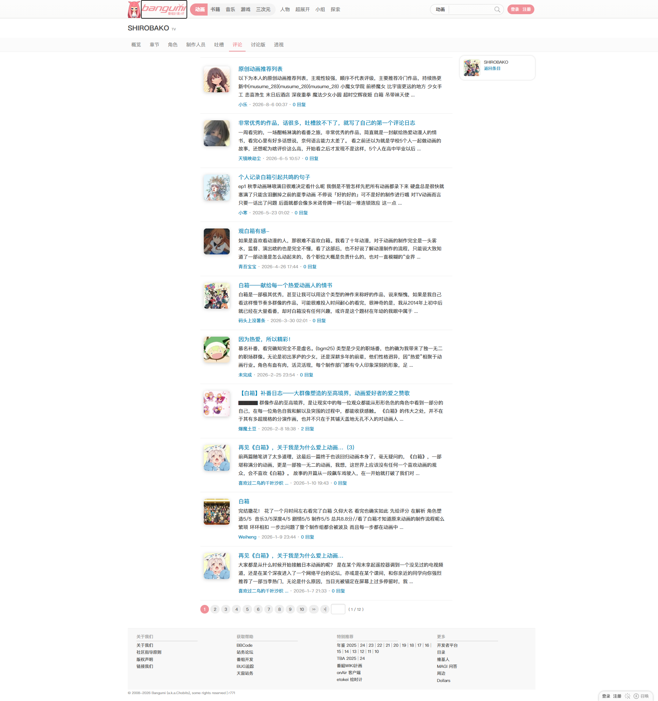
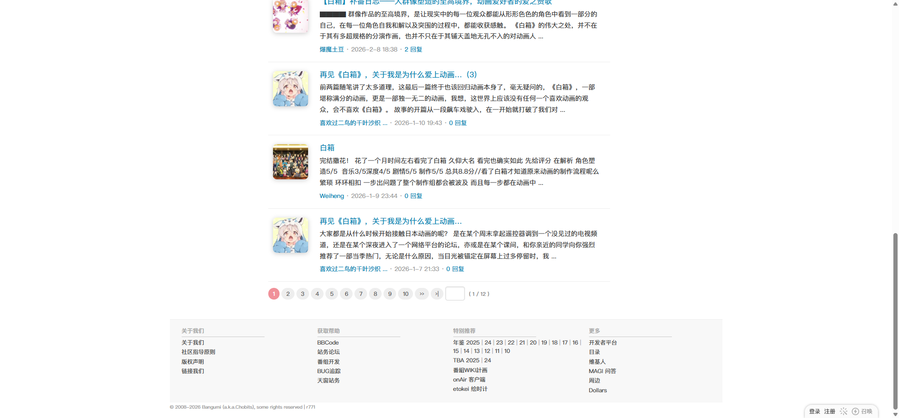

# SHIROBAKO：评论

- 来源：<https://bgm.tv/subject/110467/reviews>
- 审计环境：Chrome MCP；隔离上下文 `bangumi-audit-shirobako-reviews-20260814`；浏览器窗口 `1914 x 1026`（页面可用视口实测 `1920 x 893`，DPR `1`）；未登录状态；采集时间 `2026-08-14T12:37:33.807Z`。
- 环境：`zh-CN`、`Asia/Shanghai`、`light`；响应式范围：desktop-only（`1920 x 893`）。小于与大于该范围的布局未审计。
- 覆盖范围：条目标题与二级页签、首篇至第十篇长评摘要、分页、右侧条目回链和页脚；文档高度实测 `2028px`。滚至底部后高度未变化。

## Design tokens

| Token        | 页面实测值 / 用途                                                                                                               | 证据                                               |
| ------------ | ------------------------------------------------------------------------------------------------------------------------------- | -------------------------------------------------- |
| 主强调色     | `#f09199`；当前“评论”页签为 `rgb(240, 145, 153)`，当前页码为白字粉色圆形底                                                      | `.navTabs .focus`、`.page_inner strong.p_cur`      |
| 链接与交互色 | 标题链接默认 `rgb(0, 132, 180)` / `#0084b4`；实测悬停为 `rgb(2, 163, 251)` / `#02a3fb` 并加下划线                               | 首条 `.entry-list .title a`                        |
| 中性色与表面 | 主列与列表背景透明；条目间 `#eee` 细分隔；非当前分页背景 `#eee`、文字 `#555`                                                    | `.entry-list .item`、`.page_inner a.p`             |
| 排印层级     | 页面基线 `400 / 12px / 18px`；标题 `400 / 16px / 22.4px`、摘要 `400 / 14px / 23.8px`                                            | `.entry-list .item`、`.title`、`.content`          |
| 图像与层级   | 每条摘要的 `img.avatarCover` 为 `75 x 75px`、`object-fit: cover`、`8px` 圆角；有内侧白色高光和 `0 2px 10px rgba(0,0,0,.2)` 阴影 | `.entry-list img.avatarCover`                      |
| 形状         | 页签及条目行均 `0px` 圆角、无阴影；分页 `50px` 圆角                                                                             | `.navTabs`、`.entry-list .item`、`.page_inner a.p` |

### Token maturity

- 以上数值均来自本页的 computed style；单一可读样式表 `https://bgm.tv/css/dist/bangumi.min.css?r771` 含 `3775` 条规则，无不可读表，因此规则数不是下界。
- 文章行的 `avatarCover` 阴影是本页实测的图像局部处理，不能据此将“所有内容容器无阴影”泛化到图片。

## Layout system

- `.subjectNav` 位于 `y=109px`，为 `1905 x 41px` 的浅表面粘性导航；内部 `.navTabs` 从 `x=353px` 开始，宽 `1200px`、高 `39px`。
- 主列 `#columnInSubjectA` 位于 `x=573px`、`y=160px`，宽 `730px`；右侧 `.column-side-md` 位于 `x=1330px`，宽 `220px`、高 `87px`，只呈现条目回链。
- `.entry-list` 从 `y=173px` 至 `1737px`，含 10 个连续的 `.item.clearit` 行；每行 `730 x 156px`、`display: flex`、内边距 `15px 20px 15px 10px`。标题、摘要、作者/时间/回复信息按自上而下的阅读顺序排列。
- 分页位于 `y=1737px`，容器 `730 x 50px`、上下内边距 `10px`；页脚从 `y=1817px` 开始，高 `196px`。未观察到该页横向溢出：主导航虽为 `overflow-x: auto`，其 `scrollWidth` 与 `clientWidth` 均为 `446px`。

## Reusable components

1. **`subjectNav` / `.navTabs`**：条目内导航；本页“评论”是已选中的文字颜色状态，并非实线标签底板。
2. **`.entry-list > .item.clearit`**：长评摘要行；每行以左侧 `avatarCover`、标题、截断摘要和作者元信息组织，不是独立 Card。
3. **`.entry-list .title a`**：文章入口；默认蓝色文字，悬停变亮并添加下划线。
4. **`.page_inner`**：12 页分页控件；当前页使用粉色实心圆形，其他页是 `#eee` 浅灰圆形链接。
5. **`.column-side-md`**：仅承载本条目的缩略信息和“返回条目”链接的页面级侧栏，不将其归类为通用卡片。

### Rendered interaction states

| 组件           | 本页实测状态                                                       | 触发方式 / 证据                             | 未审计状态                          |
| -------------- | ------------------------------------------------------------------ | ------------------------------------------- | ----------------------------------- |
| 条目页签       | “评论”当前状态为 `#f09199`、无背景和无下划线                       | 初始渲染；`.navTabs .focus`                 | 非当前页签的悬停、焦点与访问后状态  |
| 文章标题链接   | 默认 `#0084b4`；悬停 `#02a3fb` 且 `text-decoration: underline`     | Chrome MCP 悬停首条标题链接                 | 激活、访问后状态                    |
| 分页           | 第 1 页为白字粉色底；第 2 页起为 `#555` 字、`#eee` 底、`50px` 圆角 | 初始渲染；共 12 页、当前为 `1 / 12`         | 翻页后的加载状态及页码悬停/焦点状态 |
| 全局 Logo 链接 | 键盘焦点显示浏览器默认 `rgb(16,16,16) auto 1px` 轮廓               | 键盘 `Tab` 后焦点落于“Bangumi 番组计划”链接 | 其余链接的键盘焦点状态              |

## Design-system delta

| 项目               | 既有基线                                                                                 | 本页证据                                            | 结论   | 建议                                                       |
| ------------------ | ---------------------------------------------------------------------------------------- | --------------------------------------------------- | ------ | ---------------------------------------------------------- |
| 文字链接与当前页签 | [基础组件与共享Tokens](../基础组件与共享Tokens.md) 的 `#0084b4` 链接、`#f09199` 当前页签 | 标题链接默认 `#0084b4`；“评论”页签 `#f09199`        | 一致   | 复用既有上下文色彩规则                                     |
| 连续列表           | 基线中的无卡片化 `.item` 说明                                                            | 本页摘要行 `0px` 圆角、无容器阴影，连续以分隔线组织 | 一致   | 复用 `entry-list`，不要替换为浮卡                          |
| 头像图像变体       | 基线未定义 `avatarCover` 的阴影与圆角                                                    | 10 个 `75 x 75px` 图像均为 `8px` 圆角并有双层阴影   | 新变体 | 将其作为内容缩略图样式候选，需跨页取证后再上升为全局 token |
| 分页               | 基线中的 `#eee`、`50px` 胶囊链接                                                         | 本页增加当前页白字粉色实心态                        | 一致   | 保留当前页与非当前页的成对变体                             |

- 引用的基线：[基础组件与共享Tokens](../基础组件与共享Tokens.md)。该引用仅用于比较，不表示其中全部组件或状态均在本页渲染。
- 本页未出现业务 Button、业务表单 Input、Checkbox、Radio、Badge 或语义 Table；顶栏存在搜索控件和原生 Select，但未对其交互状态作进一步审计。

## 页面截图

### 分页与页脚

