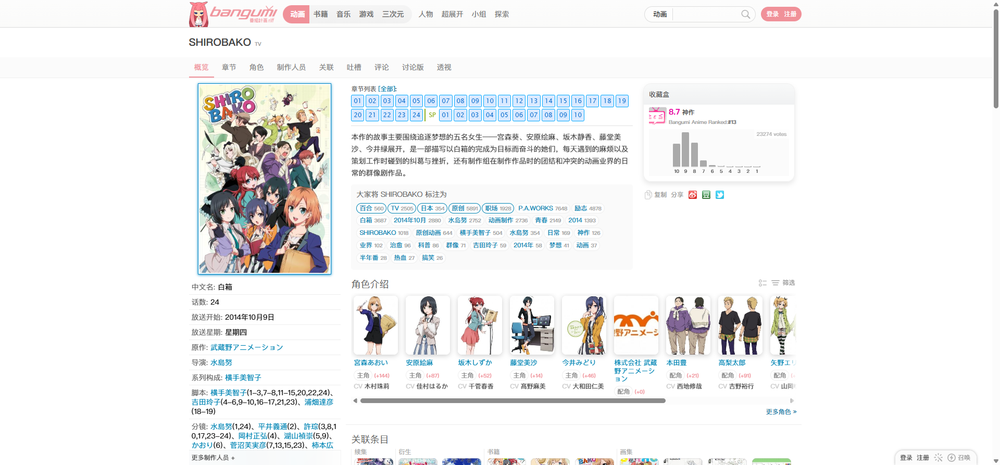
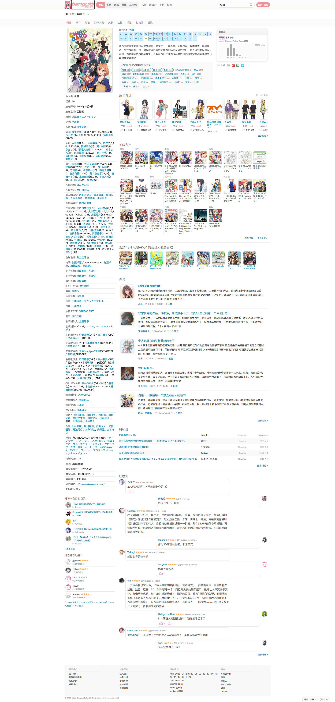
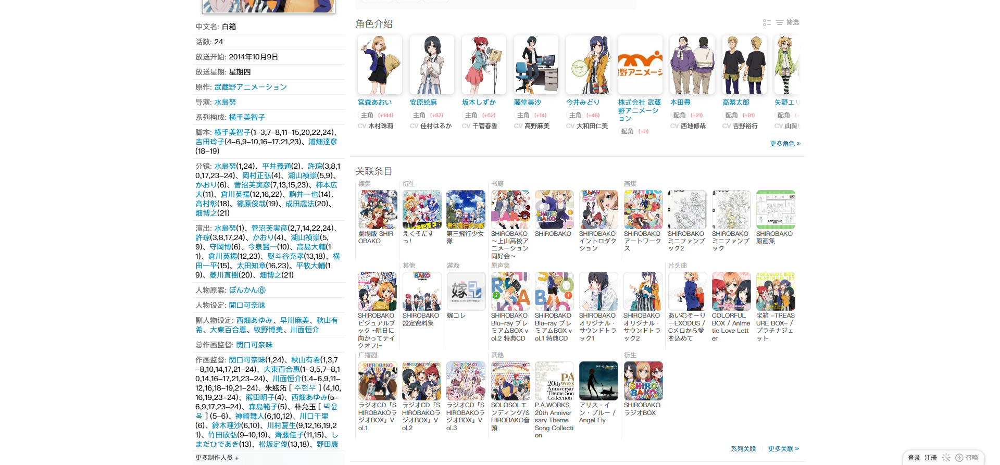
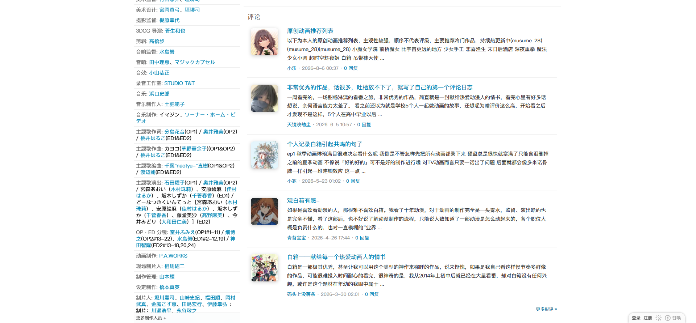
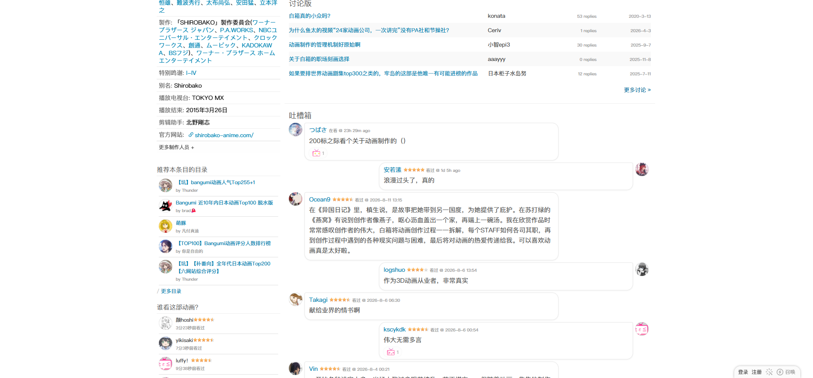
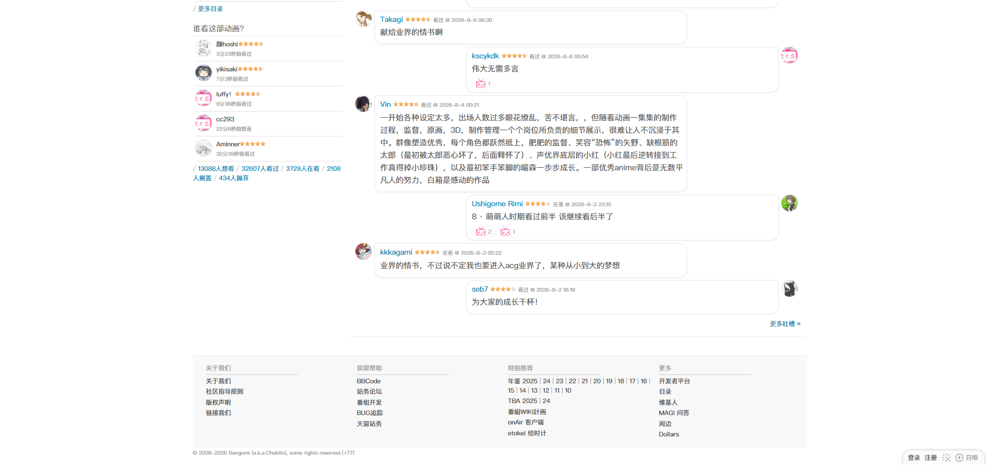

# SHIROBAKO 条目概览

- 来源：<https://bgm.tv/subject/110467>
- 审计环境：Chrome MCP；隔离上下文 `bangumi-audit-20260814-subject-home`；浏览器窗口实测 `1914 x 1026`（页面可用视口 `1920 x 893`），DPR `1`；未登录状态；采集时间 `2026-08-14T12:35:13.272Z`。
- 环境：`zh-CN`、`Asia/Shanghai`、`light`；响应式范围：desktop-only（`1920 x 893`），移动与中间视口未审计。
- 覆盖范围：从全局头部、条目 Hero、封面与元数据到角色、关联条目、评论、讨论版、吐槽箱和页脚；首次读取为 `4029px`，滚动至底部后的最终文档高度实测 `4014px`。

## Design tokens

| Token        | 页面实测值 / 用途                                                                                                                                        | 证据                                                                                 |
| ------------ | -------------------------------------------------------------------------------------------------------------------------------------------------------- | ------------------------------------------------------------------------------------ |
| 主强调色     | `#f09199`，在根节点以 `--primary-color` 暴露；当前全站分类和当前条目标签均采用该色。                                                                     | 当前分类按钮背景 `rgb(240, 145, 153)`；概览标签文字为同色。                          |
| 链接与交互蓝 | 链接蓝 `#0084b4` / `rgb(0, 132, 180)`；章节页入口在本页以 `#0066cc` 文本、`#00a8ff` 描边出现。                                                           | 元数据链接实测 `14px / 18px`、`rgb(0, 132, 180)`；首集入口为 `rgb(0, 102, 204)`。    |
| 中性色与表面 | 文字层级覆盖 `#000`、`#444`、`#555`、`#888`、`#999`，并以 `#ccc`、`#ddd`、`#eee` 作细分隔；页面白底 `#fff`，近白表面为 `#fafafa`、`#fbfbfb`、`#fefefe`。 | `body` 为白底黑字；标签云 `#fafafa`，条目导航和评分图表为 `#fbfbfb`。                |
| 语义色       | 集数按钮使用亮蓝边界/浅蓝填充；负向或错误型元数据在样式表中保留 `#c00` 体系。                                                                            | `.load-epinfo.epBtnAir` 为 `1px solid rgb(0, 168, 255)`、`rgb(218, 234, 255)` 背景。 |
| 字体栈       | `"SF Pro SC", "SF Pro Display", "PingFang SC", "Lucida Grande", "Helvetica Neue", Helvetica, Arial, Verdana, sans-serif, "Hiragino Sans GB"`。           | `body` 实测 `400 12px / 18px`。                                                      |
| 排印层级     | 条目标题 `700 20px / 26px`；分区标题 `300 18px / 25.2px`；摘要 `400 14px / 23.1px`；评论和元数据保持 `400 12px / 18px`。                                 | `.nameSingle`、`.subject_section .subtitle`、`.subject_summary` 实测。               |
| 形状与层级   | 大多数内容组为 `0px` 圆角、无阴影，依靠留白和细灰线组织。顶部分类胶囊使用 `100px` 半径；标签云是少数 `5px` 圆角的近白容器。                              | 当前“动画”分类为 `100px 0 0 100px`；评分外层和图表均无阴影。                         |

### Token maturity

- 根节点存在主题变量 `--primary-color: #f09199`，但页面仍主要依赖传统样式表的字面量颜色与选择器组合。
- 本页共发现 `1` 张样式表：`https://bgm.tv/css/dist/bangumi.min.css?r771` 可读并含 `3775` 条规则；不可读样式表为 `0`。规则数仍仅代表本次页面可读取 CSS 的下限。
- 本页已渲染的基础模式为 `Link`、全局/局部 `Navigation`、`Tabs`、信息块、分页链接及评论文本；没有可作为标准样本的通用 `Input`、`Select`、`Checkbox`、`Radio`、`Badge` 或语义 `Table`。吐槽箱仅是业务区块，不应外推为通用表单组件。

## Layout system

- 桌面壳层 `.mainWrapper` 宽 `1200px`，`padding: 0 10px`；本次可用视口下左边缘为 `x=353`。内容区 `.columns` 宽 `1180px`，高度 `3648px`，底部附加 `10px` 内边距。
- 条目页采用左侧 `292px` 封面/元数据轨道，加上右侧 `875px` 主内容轨道的编辑式双栏。评分区域位于主内容顶部右侧，宽 `269px`；摘要主列实测宽 `541px`。
- 全宽 `.subjectNav` 为高 `41px` 的 `#fbfbfb` 条带；内层 `.navTabs` 宽 `1200px`、`display: flex`、列间距 `5px`。当前标签 `14px / 18px`、`padding: 10px 10px 9px`，无圆角或阴影。
- 角色列表 `.browserCoverMedium` 宽 `855px`、高 `200px`、`display: flex`、`gap: 15px`、`flex-wrap: nowrap`、`overflow-x: auto`；其 `scrollWidth` 为 `1195px`，大于 `clientWidth`，已确认是水平滚动而非响应式换行。全局类别菜单同样使用紧凑的横向组合形态。
- 页面分区从 `y=523px` 的角色介绍开始，依次为 `y=821px` 的关联条目、`y=1589px` 的评论、`y=2450px` 的讨论版和 `y=2715px` 的吐槽箱；页脚从 `y=3803px` 延至 `3999px`。本页没有独立的“相似推荐”分区。这使信息密度维持在固定桌面壳层内，而不是用大型 Card 堆叠。

## Reusable components

1. **全局 Masthead**：Logo、分类、辅助导航、搜索及账户操作集中在高 `53px` 的页头。当前分类“动画”是白字粉底胶囊，实测 `700 14px / 25px`、`padding: 5px 8px 5px 15px`，左侧半径为 `100px`；与相邻项相接时形成不对称的组合轮廓。
2. **条目 Hero**：白色标题带使用 `.nameSingle`，标题为 `SHIROBAKO`，媒体类型 `TV` 作为小型灰色后缀。标题区仅以 `15px` 上下外边距建立呼吸感，没有大图、渐变或装饰性容器，符合信息优先的详情页取向。
3. **条目标签栏（`.subjectNav` / `.navTabs`）**：导航条为 `#fbfbfb`，当前“概览”文本切换为粉色；其余标签使用低强调中灰。标签以内边距控制可点击面积，而非按钮式边框或阴影。
4. **封面与元数据轨道（`.cover` / `#infobox`）**：左轨道宽 `292px`，上方是竖版封面，下方为长定义列表式元数据，包含译名、放送、原作、导演、制作和站点链接等。`#infobox` 在本条目中高 `2247px`，使用 `12px / 18px` 紧凑排印，适合容纳大量可扩展事实。
5. **摘要与标签云（`.subject_summary` / `.subject_tag_section`）**：摘要区域为 `541px` 宽的 `14px / 23.1px` 正文；标签云以 `#fafafa`、`5px` 圆角、`padding: 10px` 和 `5px` 纵向外边距围合，内部密集链接保持次级元数据可扫描而不干扰正文。
6. **评分与收藏信息（`.global_rating.score9` / `.chartWrapper` / `.horizontalChart`）**：右侧组件宽 `269px`，呈现 `8.7`、排名、投票数和横向评分分布。图表表面为 `#fbfbfb`、高 `90px`；本页外层实测为透明、无圆角、无阴影，数值而非卡片装饰是视觉焦点。
7. **角色横向轮播（`.browserCoverMedium`）**：重复媒体单元由肖像、蓝色姓名链接、角色身份、票数变动和声优信息组成。固定横向滚动轨道能容纳较长的角色阵容，避免主列被垂直列表拉长。
8. **内容分区（`.subject_section`）**：角色、关联、评论、讨论与吐槽均使用同一个透明分区基底，通常 `padding: 10px`、`0px` 圆角、无阴影。分区标题为轻字重 `300 18px / 25.2px`，随后用缩略图、文本清单或细线建立局部层级。
9. **评论、讨论、吐槽与页脚**：评论区的长评论标题为 `400 16px / 22.4px`，短评容器 `.comment-box` 在本页宽 `855px`、高 `984px`。讨论版位于 `y=2450px`，吐槽箱位于 `y=2715px`；其后是高 `196px` 的 `#footer`，为 `12px / 18px`、`rgb(170, 170, 170)` 文字且无背景、无边框。因此这些区块均是全页信息流，而不是弹出组件。
10. **章节选择器（跨页组件）**：本首页没有编号网格；仅有跳转到“章节”页的首集入口 `.load-epinfo.epBtnAir`。它实测为 `12px / 12px`、`padding: 5px 4px`、`3px` 圆角、浅蓝填充与亮蓝边框。完整的集数网格应在 [章节列表-SHIROBAKO](章节列表-SHIROBAKO.md) 中单独审计，不能据此首页截图声称已渲染。

## Rendered interaction states

| 组件               | 本页实测状态                               | 触发方式 / 证据                                                                                       | 未审计状态                                 |
| ------------------ | ------------------------------------------ | ----------------------------------------------------------------------------------------------------- | ------------------------------------------ |
| `.navTabs a`       | “概览”为当前页签，其他条目页签为未选中链接 | 当前 URL 为 `/subject/110467`；导航带高 `41px`，内层为 `flex`                                         | 键盘焦点、悬停及切换后的其他路由状态未审计 |
| 全局 Masthead Logo | 键盘焦点已实测                             | 从页面顶部按一次 `Tab` 后焦点落在 `.logo`；其轮廓为 `rgb(16, 16, 16) auto 1px`，`outline-offset: 1px` | 后续焦点顺序及悬停未审计                   |
| 角色横向轨道       | 默认横向溢出已实测                         | `overflow-x: auto`、`scrollWidth: 1195px`、`clientWidth: 855px`、`flex-wrap: nowrap`                  | 用户拖动、键盘滚动和末端状态未审计         |
| 章节入口           | 首集入口已渲染，完整编号网格未在本页渲染   | `.load-epinfo.epBtnAir` 的计算样式                                                                    | 章节选择和加载状态应在章节路由审计         |

## Design-system delta

| 项目           | 既有基线                                                        | 本页证据                                                                 | 结论   | 建议                              |
| -------------- | --------------------------------------------------------------- | ------------------------------------------------------------------------ | ------ | --------------------------------- |
| 主强调色与导航 | [基础组件与共享Tokens](../基础组件与共享Tokens.md) 的 `#f09199` | 当前分类与当前条目页签均使用该强调色                                     | 一致   | 复用                              |
| 双栏条目布局   | 无                                                              | `.columns` 为 `1180px` 宽 `flex`，左侧信息轨 `292px`、右侧主区约 `875px` | 新变体 | 作为条目详情页组合记录            |
| 标签云         | 无                                                              | `.subject_tag_section` 为 `#fafafa`、`5px` 圆角的 `541px` 表面           | 新变体 | 不在单页证据基础上提升为全局 Card |

- 引用的基线：[基础组件与共享Tokens](../基础组件与共享Tokens.md)。该引用仅用于比较，不表示其所有组件或状态均在本页渲染。

## 页面截图

### 角色与关联条目

### 评论

### 讨论与吐槽

### 吐槽底部与页脚

