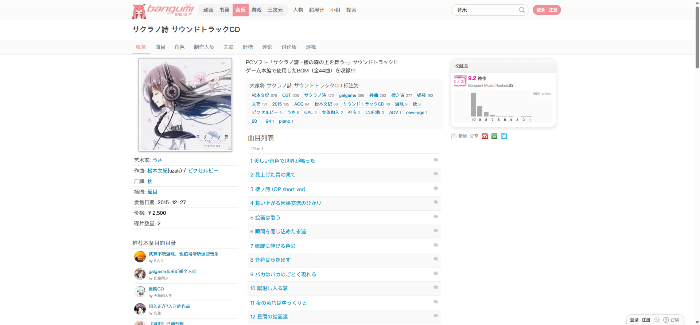
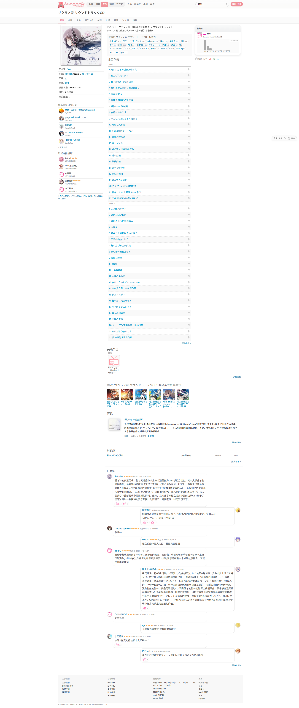

# サクラノ詩 サウンドトラックCD 条目概览

- 来源：<https://bgm.tv/subject/163164>
- 审计环境：Chrome MCP；隔离上下文 `bangumi-audit-sakurano-20260814`；浏览器窗口 `1914 x 1026`（页面可用视口实测 `1920 x 893`，DPR `1`）；未登录（页面出现“登录”入口）；采集时间 `2026-08-14T15:28:50.985Z`。
- 环境：`zh-CN`、`Asia/Shanghai`、`light`；响应式范围：desktop-only（`1920 x 893`）。移动端和其他断点未审计。
- 覆盖范围：从条目头、元数据与曲目，至评分、关联、评论、讨论、吐槽和页脚；文档高度实测 `4498px`。滚至底部后高度未变化。
- 样式表：共 `1` 个，均可读取（`https://bgm.tv/css/dist/bangumi.min.css?r771`）；可读规则 `3775` 条，因无不可读样式表，该计数不需要按下限解释。

## Design tokens

| Token        | 页面实测值 / 用途                                                                                                                                                                                       | 证据                                                         |
| ------------ | ------------------------------------------------------------------------------------------------------------------------------------------------------------------------------------------------------- | ------------------------------------------------------------ |
| 字体与正文   | 全局字体栈为 `"SF Pro SC", "SF Pro Display", "PingFang SC", "Lucida Grande", "Helvetica Neue", Helvetica, Arial, Verdana, sans-serif, "Hiragino Sans GB"`；页面正文为 `400 12px/18px`、`rgb(0, 0, 0)`。 | `.wrapperNeue`                                               |
| 主强调与链接 | 根自定义属性 `--primary-color` 为 `#f09199`；当前“概览”标签为 `rgb(240, 145, 153)`；常规条目链接实测为 `rgb(0, 132, 180)`。                                                                             | `documentElement`、`.navTabs .focus`、条目链接               |
| 中性色与表面 | `.subjectNav` 背景为 `rgb(251, 251, 251)`；主体容器透明，页面由连续白色内容面组织。                                                                                                                     | `.subjectNav`、`.wrapperNeue`                                |
| 排印层级     | 当前 tab 为 `400 14px/18px`；简介为 `400 14px/23.1px`、`rgb(68, 68, 68)`；曲目区为 `400 12px/21.6px`。                                                                                                  | `.navTabs .focus`、`#subject_summary`、`.subject_ep_section` |
| 形状与层级   | 主要内容、tab 与信息区均为 `0px` 圆角、`none` 阴影；顶部 `#headerNeue2` 例外，使用 `rgba(250, 250, 250, 0.8) 0 0 0 1px` 描边式阴影。                                                                    | `.wrapperNeue`、`.navTabs`、`#infobox`、`#headerNeue2`       |

### Token maturity

- `#f09199`、`#0084b4`、`12px / 18px` 与直角、无投影的内容面均与 [基础组件与共享Tokens](../基础组件与共享Tokens.md) 的既有基线一致。
- 本页的简介行高 `23.1px` 与曲目行高 `21.6px` 是内容模块的实测排印变体，不应直接提升为全局正文 token。
- 未登录页面仅渲染顶栏搜索的原生 `combobox`、`textbox` 与“搜索”按钮；未观察到业务表单的 Button、Checkbox、Radio 或语义 Table，故不为这些组件定义本页规格。

## Layout system

- 顶部全局栏 `#headerNeue2` 高 `53px`，其下 `.subjectNav` 位于绝对 Y=`53px`、高 `41px`，承载宽 `1200px` 的 `.navTabs`；当前 tab 尺寸 `48 x 39px`，内边距 `10px 10px 9px`。
- 主内容 `.columns` 以 flex 组织，实测宽 `1180px`、左边界 X=`150px`、底部前高度 `4117px`；信息被拆入左右阅读轨道，而非浮层卡片。
- 首屏左侧包含封面与 `#infobox`（实测 `292px` 宽）；右侧先呈现简介、标签与曲目。`.subject_ep_section` 从绝对 Y=`366px` 开始，宽 `531px`、高 `1831px`，以顺序曲目而非分栏数据表支持连续阅读。
- 纵向主段依次为：关联条目 Y=`2207px`，推荐条目 Y=`2434px`，评论 Y=`2615px`，讨论版 Y=`2851px`，吐槽箱 Y=`2980px`，页脚 Y=`4287px`。这证实本页不是只包含首屏的条目概览。
- 所有本页采样的容器 `scrollWidth` 等于 `clientWidth`，且 `overflow-x` 为 `visible` 或 `hidden`；未证实可横向滚动的封面带，因此不将关联条目描述为横向溢出组件。

## Reusable components

1. **`headerHero` / `nameSingle`**：条目名和媒介身份位于顶部，并接续局部导航；本页只验证其在音乐条目概览中的组合。
2. **`subjectNav` / `.navTabs`**：9 个文字链接形成概览、曲目、角色、制作人员、关联、吐槽、评论、讨论版与透视的本地导航。`.navTabs` 为 flex，宽 `1200px`，当前态以粉色文字区分，未使用边框或底色。
3. **`#infobox` 与封面**：`292px` 宽的信息轨道将艺术家、作曲、厂牌、插图、发售日、价格和碟片数编为事实列表；它是条目页的元数据构成，不等同于通用 Card。
4. **`.subject_ep_section`**：两张碟的 44 首曲目按 Disc 分组，保留指向曲目页的“更多曲目”链接；`12px / 21.6px` 的列表密度是音乐条目内容变体。
5. **`.global_rating` / 评分分布**：实测区域宽 `269px`，呈现 `9.2`、排名、票数与 10 至 1 分的可点击统计链接；当前页面只证明其静态与链接触发面。
6. **关联、推荐与社区段**：关联条目、偏好推荐、评论、讨论版与吐槽箱采用同一纵向阅读流。吐槽箱 `#comment_box` 高 `1198px`、宽 `855px`，将底部互动内容收束到页脚之前。

### Rendered interaction states

| 组件         | 本页实测状态                                                                                                       | 触发方式 / 证据                                                                       | 未审计状态                                                    |
| ------------ | ------------------------------------------------------------------------------------------------------------------ | ------------------------------------------------------------------------------------- | ------------------------------------------------------------- |
| `.navTabs`   | “概览”当前态：`#f09199`、`400 14px/18px`、`10px 10px 9px`；“曲目”悬停态：`rgb(54, 156, 248)`、透明背景、无下划线。 | 鼠标悬停“曲目”链接，元素 `48 x 39px`、`cursor: pointer`；见下方截图与新鲜 a11y 快照。 | 键盘焦点与非当前 tab 的点击后页面状态未审计，避免离开目标页。 |
| 顶栏搜索     | 默认状态包含“音乐”combobox、textbox 与“搜索”按钮。                                                                 | 初始 a11y 快照。                                                                      | 输入、提交、错误与结果状态未触发。                            |
| 评分分布链接 | 默认渲染 10 至 1 分的可点击链接。                                                                                  | 初始 a11y 快照中的分值链接。                                                          | 点击后的筛选/弹层行为未触发。                                 |
| 吐槽互动计数 | 默认渲染部分数字链接。                                                                                             | 初始 a11y 快照中的吐槽条目。                                                          | 点击后的明细或提示层未触发。                                  |

## Design-system delta

| 项目               | 既有基线                                                                                    | 本页证据                                                                       | 结论   | 建议                                                             |
| ------------------ | ------------------------------------------------------------------------------------------- | ------------------------------------------------------------------------------ | ------ | ---------------------------------------------------------------- |
| 颜色与正文 token   | [基础组件与共享Tokens](../基础组件与共享Tokens.md) 中的 `#f09199`、`#0084b4`、`12px / 18px` | 当前 tab、常规链接和 `.wrapperNeue` 的 computed style                          | 一致   | 复用既有 token。                                                 |
| Tabs               | 基线：`39px` 高、`10px 10px 9px`、当前态 `#f09199`                                          | `.navTabs` 高 `39px`，当前“概览”与上述值相符；“曲目”悬停为 `rgb(54, 156, 248)` | 一致   | 在基线的 Tabs 状态说明中保留当前态；悬停值可作为已证实状态补充。 |
| 音乐曲目列表       | 无                                                                                          | `.subject_ep_section` 为 `12px / 21.6px` 的两碟连续列表                        | 新变体 | 作为 Subject 的音乐内容变体记录，不泛化为语义 Table。            |
| 关联内容的溢出行为 | 旧报告声称横向溢出                                                                          | 本页采样容器均未出现 `scrollWidth > clientWidth`                               | 冲突   | 删除横向溢出描述；仅将其记录为纵向关联内容。                     |

- 引用的基线：[基础组件与共享Tokens](../基础组件与共享Tokens.md)。该引用仅用于比较，不表示其所有组件或状态均在本页渲染。

## 页面截图

### 当前 tab 悬停

### 吐槽底部与页脚

