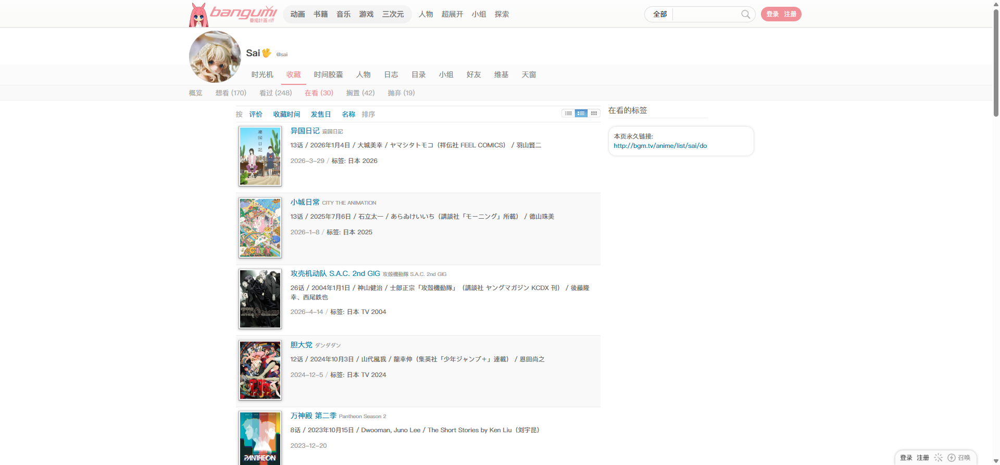
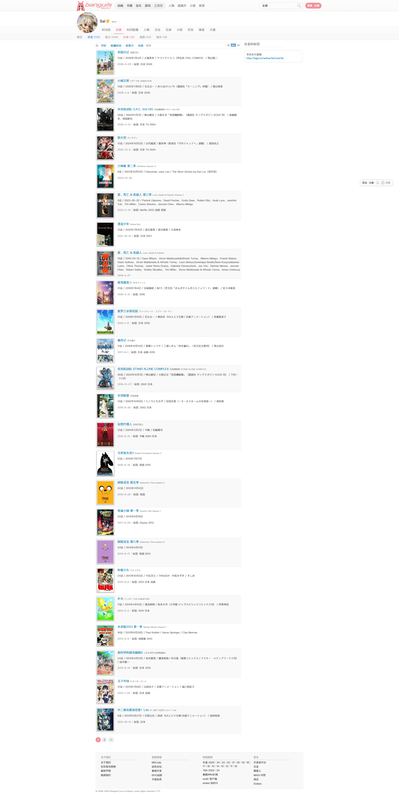
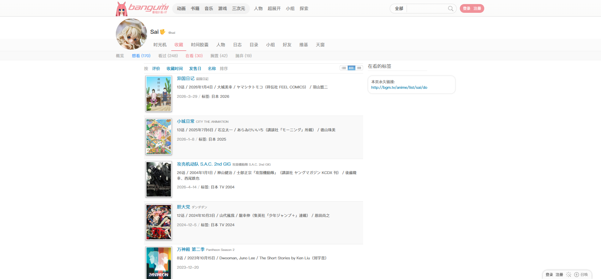
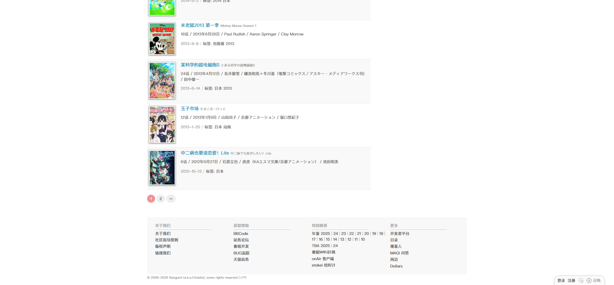

# Sai：在看的动画

- 来源：<https://bgm.tv/anime/list/sai/do>
- 审计环境：Chrome MCP；隔离上下文 `audit-sai-anime-do-20260814`；窗口 `1920 x 1032`（页面可用视口实测 `1920 x 893`，DPR `1`）；未登录状态；采集时间 `2026-08-14T13:27:58.894Z`。
- 环境：`zh-CN`、`Asia/Shanghai`、`light`；响应式范围：`desktop-only`（未检查移动端及其他桌面宽度）。
- 覆盖范围：从全局导航、用户页签、排序与视图切换、24 条本页可见收藏行、分页，至页脚；字体和图片加载完成后的文档高度实测 `3828px`。初始高度为 `3711px`，滚动时懒加载将其扩展。
- 样式表：共 `1` 张，均可读取，为 `https://bgm.tv/css/dist/bangumi.min.css?r771`，可读规则数 `3775`；无不可读样式表，因此该规则数不是下限。

## Design tokens

| Token            | 页面实测值 / 用途                                                                                                                                             | 证据                                              |
| ---------------- | ------------------------------------------------------------------------------------------------------------------------------------------------------------- | ------------------------------------------------- |
| 正文与字体栈     | `400 12px/18px`；`"SF Pro SC", "SF Pro Display", "PingFang SC", "Lucida Grande", "Helvetica Neue", Helvetica, Arial, Verdana, sans-serif, "Hiragino Sans GB"` | `.browser-list` 与列表行                          |
| 当前导航强调色   | `rgb(240, 145, 153)`（`#f09199`）；主页签为 `400 14px/18px`，状态页签为 `400 13px/18px`                                                                       | `.navTabs .focus`、`.navSubTabs .focus`           |
| 可触发链接 hover | `rgb(54, 156, 248)`，透明背景、无下划线、无阴影                                                                                                               | 悬停“想看 (170)”的 `.navSubTabs a`                |
| 列表表面         | 奇数行透明；偶数行 `rgb(249, 249, 249)`；均无边框、`0px` 圆角和阴影                                                                                           | `.browser-list .item`、`.browser-list .item.even` |
| 封面与行间距     | 首个 `.subjectCover` 为 `84 x 121px`、左浮动；列表行内边距 `7px 5px`                                                                                          | 首行 `.cover.subjectCover` 与 `.item`             |
| 分页             | `#555` 文字、`#eee` 背景、`padding: 4px 10px`、右外边距 `4px`、`50px` 圆角、无阴影                                                                            | `.page_inner a.p`                                 |

### Token maturity

- 本页只证明上述值在 `1920px` 桌面视口、未登录状态下渲染；`#f09199` 和行表面可作为共享基线的页面级佐证，但不因单页测量新增全局 token。
- 悬停蓝色仅在状态页签的“想看”链接上触发，不能据此泛化为所有链接状态。
- 页面未出现业务表单 `button`、业务 `select`、业务 `checkbox`、`radio`、通用 `badge` 或语义 `table`；顶栏可见的原生搜索 `select` 属于全局搜索而非本页业务控件。

## Layout system

- `.columns` 从 `x=453, y=193` 开始，宽 `1000px`；主内容 `#browserItemList.browserFull.browser-list` 宽 `700px`、高 `3177px`，从 `y=235` 延续至 `y=3412`。右侧“在看的标签”栏的标题宽 `190px`，但采集时其 `.tagList` 高为 `0px`，没有可见标签内容。
- 用户名在 `y=84`；主 `navTabs` 位于 `y=124`、`567 x 39px`，第二层收藏状态页签位于 `y=164`、`1200 x 28px`。状态页签为 flex 布局，`overflow-x: auto`，但本页 `scrollWidth` 与 `clientWidth` 都为 `1200px`，没有实测到横向溢出。
- 排序、精简/列表/网格的 `.filters` 位于列表前方（`y=209`，`268 x 20px`）；其后是 24 条本页可见的连续结果行，而状态页签显示的“在看 (30)”是该分类计数，并非本页行数。
- 首行高 `136px`，末行高 `92px`；高度由条目的元信息和个人收藏信息决定。分页位于 `y=3422`，页脚位于 `y=3500`、高 `196px`，形成顺序阅读至底的单列主流程。

## Reusable components

1. **用户页签 `.navTabs`**：以“收藏”为当前页签；当前项为粉色文字，`padding: 10px 10px 9px`、直角、无阴影。它提供用户级导航，而不是内容卡片容器。
2. **收藏状态页签 `.navSubTabs`**：展示概览及想看、看过、在看、搁置、抛弃的分类计数；当前“在看 (30)”使用粉色文字，`padding: 5px 10px`。
3. **排序与视图链接 `.filters`**：提供按评价、收藏时间、发售日、名称排序，以及精简、列表、网格视图触发项；这是行内链接控制，不是 Select 组件。
4. **结果列表 `#browserItemList.browserFull.browser-list` 与 `.item`**：`700px` 宽的连续列表，奇偶行通过透明/浅灰交替组织扫描节奏；没有 Card 边框、圆角或投影。
5. **封面与收藏信息 `.cover.subjectCover`、`.collectInfo`**：封面在左，信息区宽 `590px`；`.collectInfo` 用 `padding-top: 10px` 放置收藏日期和标签等辅助信息。
6. **分页 `.page_inner`**：位于结果末尾，使用浅灰胶囊链接呈现可跳转页码。页脚紧随其后，不另起浮层。

### Rendered interaction states

| 组件              | 本页实测状态                                                    | 触发方式 / 证据                                                      | 未审计状态                                    |
| ----------------- | --------------------------------------------------------------- | -------------------------------------------------------------------- | --------------------------------------------- |
| `.navTabs`        | “收藏”为当前状态，粉色文字                                      | 页面初始渲染；`.navTabs .focus` 为 `#f09199`                         | 其他主页签的 hover、focus、访问后状态         |
| `.navSubTabs`     | “在看 (30)”为当前状态；“想看 (170)”悬停变为 `rgb(54, 156, 248)` | Chrome MCP 指针悬停“想看 (170)”；透明背景、无阴影、`cursor: pointer` | 键盘 focus、其他状态页签的 hover、加载/空状态 |
| `.page_inner a.p` | 页码 1、2、下一页和末页链接可见                                 | 页面末段；默认样式为浅灰背景胶囊                                     | hover、focus、被禁用或末页状态                |
| `.filters`        | 排序及精简/列表/网格触发项可见                                  | 列表前的默认渲染                                                     | 点击后的排序与视图切换结果                    |

## Design-system delta

| 项目              | 既有基线                                              | 本页证据                                                                         | 结论   | 建议                                                               |
| ----------------- | ----------------------------------------------------- | -------------------------------------------------------------------------------- | ------ | ------------------------------------------------------------------ |
| 正文与连续列表    | 400 / 12px / 18px；`.item` 为无卡片化连续表面         | `.browser-list` 为 `400 12px/18px`；`.item` 无边框、阴影和圆角，内边距 `7px 5px` | 一致   | 复用                                                               |
| 主页签与状态页签  | 主页签 `14px/18px`、`10px 10px 9px`；当前色 `#f09199` | `.navTabs .focus` 与 `.navSubTabs .focus` 直接实测到对应尺寸和颜色               | 一致   | 复用                                                               |
| 偶数列表行表面    | 基线记录 `#fbfbfb` / `#fafafa` 浅表面                 | `.item.even` 实测为 `rgb(249, 249, 249)`（`#f9f9f9`）                            | 新变体 | 先作为列表交替行的候选值保留，需其他列表页复核后再归入共享 token   |
| 页码胶囊链接      | `#eee` 背景、`50px` 圆角、`4px 10px` 内边距           | `.page_inner a.p` 完全匹配                                                       | 一致   | 复用                                                               |
| 状态页签 hover 色 | 基线仅列出普通链接和当前状态，未列该 hover 值         | “想看 (170)”实测为 `rgb(54, 156, 248)`                                           | 新变体 | 以状态页签 hover 局部变体记录，勿作为通用链接 token                |
| 右侧标签内容      | 基线提及用户页可能存在语义标签类                      | 本页仅有“在看的标签”标题，`.tagList` 高 `0px`                                    | 待确认 | 不将标签内容组件标记为本页已渲染；在有实际标签内容的用户页继续取证 |

- 引用的基线：[基础组件与共享Tokens](../基础组件与共享Tokens.md)。该引用仅用于比较，不表示其所有组件或交互状态均在本页渲染。

## 页面截图

### 状态页签悬停

### 列表底部与页脚

