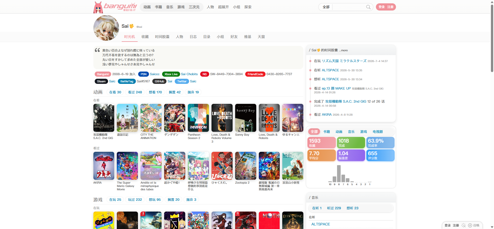

# Sai 用户时光机

- 来源：<https://bgm.tv/user/sai>
- 审计环境：Chrome MCP；隔离上下文 `sai-timeline-audit-20260814`；窗口实测 `237 x 39`（页面可用视口实测 `1920 x 893`，DPR `1`）；未登录状态；采集于 `2026-08-14T13:16:47.459Z`。
- 环境：`zh-CN`、`Asia/Shanghai`、`light`；响应式范围：`desktop-only`（仅审计 `1920 x 893`，未检查移动端及其他断点）。
- 覆盖范围：从用户身份头、动画/游戏/日志、电视剧与书籍模块，到右侧时间胶囊、统计、音乐、目录、好友、小组和 `y=2704` 的页脚；文档高度实测 `2915px`，滚动至底后未变化。
- 样式表：共 `1` 份、均可读（`https://bgm.tv/css/dist/bangumi.min.css?r771`，`3775` 条规则）；故可读规则数为 `3775`，无跨域不可读样式表。

## Design tokens

| Token          | 页面实测值 / 用途                                                                                                                                           | 证据                                      |
| -------------- | ----------------------------------------------------------------------------------------------------------------------------------------------------------- | ----------------------------------------- |
| 页面与主强调色 | `--primary-color: #f09199`；当前“时光机”页签为 `rgb(240, 145, 153)`                                                                                         | 文档根变量；`.navTabs .focus`             |
| 正文与弱元信息 | 页面基线为 `400 / 12px / 18px`；主列 `user_box` 前景为 `rgb(51, 51, 51)`，页脚为 `rgb(170, 170, 170)`                                                       | `.user_box`、`#footer` 计算样式           |
| 用户身份头像   | `.headerAvatar` 为 `100 x 103px`，无边框、圆角或阴影，负上外边距 `-25px` 使其跨接页签区域                                                                   | `.headerAvatar`                           |
| 当前页签       | `400 / 14px / 18px`；`padding: 10px 10px 9px`；透明、直角、无阴影                                                                                           | `.navTabs .focus`                         |
| 主列表面       | `.user_box` 为透明、`0px` 圆角、无边框和阴影；外边距 `5px 0 10px`                                                                                           | `.user_box`                               |
| 右栏面板       | 时间胶囊 `.SidePanel.png_bg`：`1px solid #f0f0f0`、`15px` 圆角、`0 5px 10px rgba(0,0,0,.09)`；统计 `.userStats`：`1px solid #e8e8e8`、`15px` 圆角、双层阴影 | 右栏两个已渲染模块                        |
| 封面标题悬停   | 书籍封面标题悬停为 `#555`、`400 / 11px / 13.2px`、下划线                                                                                                    | `#book .browserCoverMedium a` 的 `:hover` |

### Token maturity

- 本页同时存在连续、无卡片化的主列和圆角投影的右栏面板；两者是页面内不同模块变体，不能归并为单一 Card token。
- `#f09199` 是本页当前页签和根变量的实测强调色。未将其他页面的链接、统计色或未渲染控件状态视为本页证据。

## Layout system

- `.mainWrapper` 的宽度为 `1200px`（含左右各 `10px` 内边距），位于 `x=353`；内容从 `x=363` 的 `817px` 主列与 `x=1189` 的 `350px` 右栏开始，间隔 `9px`。
- 用户头像和用户名位于 `y=59` 起的身份头；`.navTabsWrapper` 与 `.navTabs` 位于 `x=473, y=124`，均为 `567 x 39px` 的单行 flex 布局。`ul.navTabs` 的间隔为 `5px`，没有溢出。
- 主列按媒介顺序连续阅读：简介 `y=179-336`，动画 `346-746`，游戏 `766-1178`，日志 `1197-1815`，电视剧 `1835-2234`，书籍 `2254-2654`；页脚从 `y=2704` 开始。
- 右栏独立向下堆叠：时间胶囊 `y=174-476`、统计 `491-734`、音乐 `749-1079`、目录 `1093-1299`、好友 `1314-1612`、收藏人物 `1627-1824`、小组 `1839-2184`，随后为订阅/维基编辑菜单 `y=2199-2257`。
- 每个媒介区的 `.browserCoverMedium.coverList.oneLine.scrollable` 是单行封面网格，不是横向滚动容器：动画首组为 `817 x 154px`，`display: grid`、`overflow-x: visible`，且 `scrollWidth = clientWidth = 817px`。类名 `scrollable` 不足以证明可滚动。

## Reusable components

1. **`headerAvatar` / 用户页签**：`100px` 用户头像与 `navTabs` 共同建立个人上下文；时光机、收藏、时间胶囊、人物、日志、目录、小组、好友等链接均在同一局部导航中。
2. **`user_box`**：仅承载个人签名、加入日期和外部账号；它是主列连续信息流的一段，不是带阴影的 Card。
3. **媒介区 `.section` + `browserCoverMedium coverList oneLine`**：动画、游戏、电视剧和书籍各提供状态筛选条及两行封面列表；封面区以固定可见宽度展示，不在本页横向滚动。
4. **`.SidePanel.png_bg` 时间胶囊**：右栏独立面板，以垂直节点和时间戳组织最近活动。
5. **`.userStats`**：右栏统计面板，顶部为媒介切换条，下方以彩色统计块和柱状分布展示收藏、完成率、均分等汇总；其圆角与阴影是右栏模块特有变体。

### Rendered interaction states

| 组件             | 本页实测状态                                                        | 触发方式 / 证据                                                          | 未审计状态                         |
| ---------------- | ------------------------------------------------------------------- | ------------------------------------------------------------------------ | ---------------------------------- |
| `.navTabs`       | 默认“收藏”标签为 `#888`；当前“时光机”为 `#f09199`                   | 当前路由已渲染 `.focus`；尺寸 `62 x 39px`                                | 非当前页签的悬停与加载态未审计     |
| 书籍封面标题链接 | 悬停后为 `#555` 且有下划线                                          | 对“ドラえもん (藤子·F·不二雄大全集)”链接执行 hover；新快照后读取计算样式 | 访问态、禁用态未渲染               |
| 全局 Logo 链接   | 键盘焦点显示 `rgb(16, 16, 16) auto 1px` 轮廓，`outline-offset: 1px` | 自页面顶部按 `Tab`，焦点落在 Logo                                        | 其他链接的逐一焦点样式未审计       |
| 顶栏搜索         | `combobox`、文本框与“搜索”按钮在未登录状态渲染                      | 首次无障碍快照                                                           | 搜索结果、错误和提交后的状态未触发 |

## Design-system delta

| 项目 | 既有基线 | 本页证据 | 结论 | 建议 |
| --- | --- | --- | --- |
| Tabs 当前项 | [共享 Tokens](../基础组件与共享Tokens.md) 记录 `#f09199`、`10px 10px 9px`、直角无阴影 | `.navTabs .focus` 的实测值相同 | 一致 | 复用既有 Tabs 基线 |
| 主列连续表面 | 基线将 `.item` 描述为无卡片化表面 | `.user_box` 透明、`0px` 圆角、无边框/阴影 | 一致 | 继续作为连续信息流容器，不创建 Card |
| 右栏面板 | 既有基线未记录用户页右栏圆角投影面板 | `.SidePanel.png_bg` 和 `.userStats` 均为 `15px` 圆角并带边框/阴影 | 新变体 | 在用户模块作用域新增右栏 Panel 变体；不扩展为全站 Card |
| 封面区溢出 | 既有报告曾将其描述为滚动封面带 | 本页 `overflow-x: visible` 且滚动宽度不大于客户端宽度 | 冲突 | 修正页面记录，移除横向滚动主张 |

- 引用的基线：[基础组件与共享Tokens](../基础组件与共享Tokens.md)。该引用仅用于比较，不表示其所有组件或状态均在本页渲染。

## 页面截图

- 已核验的首屏资产见上图。Chrome MCP 的 `Page.captureScreenshot` 在本次采集时两次协议超时，因此未写入新的全页或底部 PNG；不将缺失截图作为已采集证据。
- 无障碍快照已保存为 [用户-Sai-时光机-a11y.txt](../assets/用户-Sai-时光机-a11y.txt) 与 [用户-Sai-时光机-底部-a11y.txt](../assets/用户-Sai-时光机-底部-a11y.txt)，分别对应首屏和滚至底部的结构核查。
