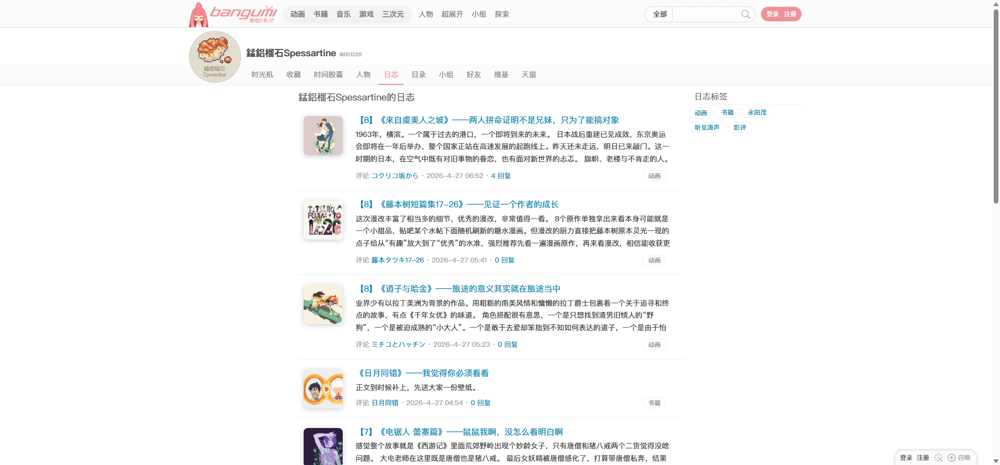
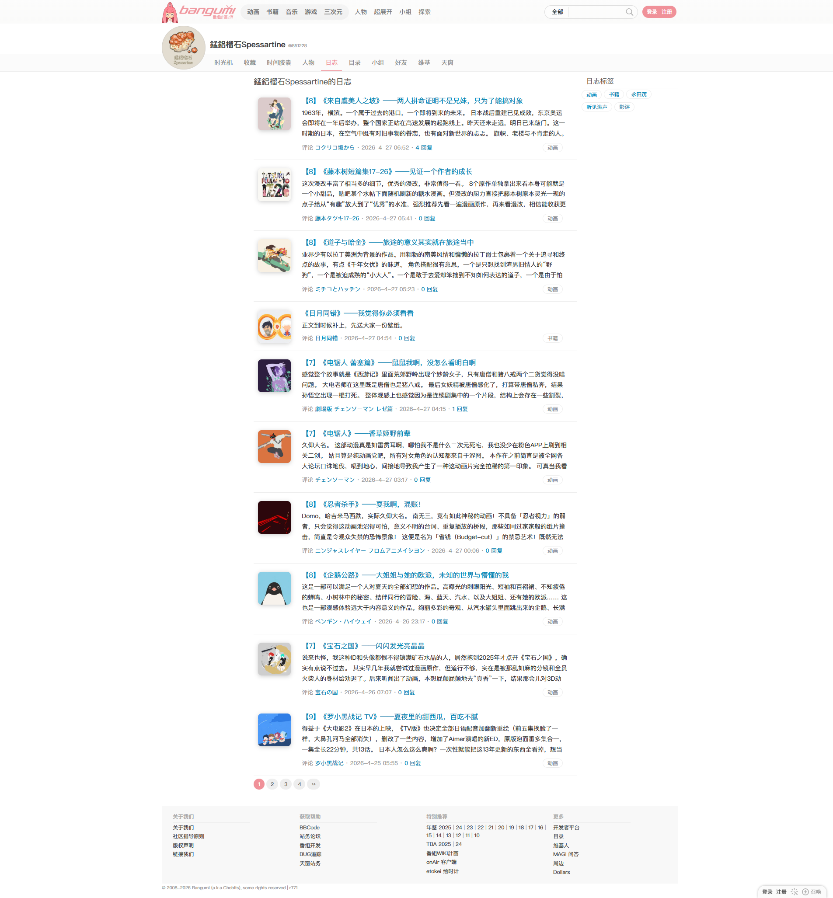
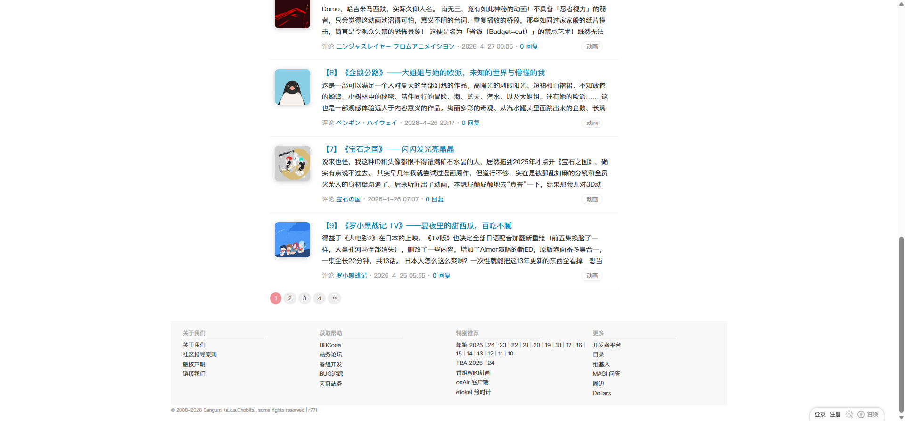

# 锰铝榴石 Spessartine：日志列表

- 来源：<https://bgm.tv/user/851228/blog>
- 审计环境：Chrome MCP；隔离上下文 `audit-spessartine-blog-20260814`；浏览器窗口 `1920 x 1032`（页面可用视口实测 `1920 x 893`，DPR `1`）；未登录状态；采集时间 `2026-08-14T13:30:44.533Z`。
- 环境：`zh-CN`、`Asia/Shanghai`、`light`；响应式范围：desktop-only（未检查移动端与其他断点）。
- 覆盖范围：用户身份区、页签、10 条日志摘要、日志标签侧栏、分页与页脚；文档高度实测 `2054px`。滚动至底部后高度未变化。
- 样式表：共 `1` 份，均可读取（`https://bgm.tv/css/dist/bangumi.min.css?r771`），可读规则数 `3775`；本页没有不可读取样式表，因此该计数不是下限。

## Design tokens

| Token          | 页面实测值 / 用途                                                                                                                            | 证据                                          |
| -------------- | -------------------------------------------------------------------------------------------------------------------------------------------- | --------------------------------------------- |
| 导航强调色     | 当前“日志”页签为 `rgb(240, 145, 153)`（`#f09199`）。                                                                                         | `.navTabs a.focus`，400 / 14px / 18px         |
| 链接与交互色   | 日志标题默认 `rgb(0, 132, 180)`（`#0084b4`）；悬停为 `rgb(2, 163, 251)`（`#02a3fb`）并出现下划线。                                           | `.entry-list .item h2 a`，400 / 16px / 22.4px |
| 正文与弱元数据 | 日志项继承 `rgb(0, 0, 0)`、400 / 12px / 21.6px；页脚为 `rgb(170, 170, 170)`。                                                                | `.entry-list .item`、`#footer`                |
| 形状与层级     | 列表项和双栏容器均透明、`0px` 圆角、无阴影；关联对象封面是例外，`75 x 75px`、`8px` 圆角，带内嵌白色高光和 `0 2px 10px rgba(0,0,0,.2)` 阴影。 | `.entry-list .item`、`.avatarCover`           |

### Token maturity

- `#f09199`、`#0084b4` 与共享基线一致；`#02a3fb` 仅记录为本页标题链接已触发的悬停状态，不提升为全局链接 token。
- 本页不存在业务表单、通用 Badge 或语义 Table；顶栏的原生搜索 `select`、输入框和“搜索”提交控件存在，但未作为日志列表业务组件审计。

## Layout system

- 用户头部位于 `y=53`，高 `111px`；`navTabsWrapper` 从 `x=473` 开始，宽 `567px`、高 `39px`。它是普通文档流布局，未观察到固定定位。
- `.columns` 位于 `x=363, y=164`，宽 `1180px`，采用 flex；主列 `#columnA` 宽 `740px`，右侧 `#columnB` 宽 `220px`，左外边距 `10px`。两列均 `overflow: visible`，`scrollWidth` 等于 `clientWidth`，未观察到横向滚动。
- 主列标题从 `y=174` 开始，`.entry-list` 从 `y=204` 到 `1775`。十条日志按顺序连续排列：第 1、2、3、5 至 10 条均高 `162px`，第 4 条因摘要简短为 `113px`；列表自身没有卡片容器表面。
- 页脚从 `y=1843` 开始，高 `196px`；分页位于列表末尾和页脚之间，维持从阅读流到跨页导航的顺序。

## Reusable components

1. **`#headerProfile` 与 `.navTabsWrapper`**：用户身份、头像和本地导航。页签每项以 `10px 10px 9px` 内边距占据 `39px` 高；当前日志页签由 `focus` 类表达选中状态。
2. **`.entry-list > .item`**：摘要阅读流的重复单元。每条采用 flex，宽 `740px`，内边距 `15px 20px 15px 10px`，无背景、无圆角、无阴影；封面、标题、摘要和评论/关联条目按行内信息层级排列。
3. **`.avatarCover`**：日志关联条目的 `75 x 75px` 封面入口。它是单个媒体缩略图，而非列表项的通用 Card 容器。
4. **`.sidePanelHome .item-tags`**：右侧“日志标签”文字导航，宽 `220px`、高 `47px`、`display: flex`；仅说明当前用户日志页的标签筛选入口，不泛化为全站 Badge。
5. **分页与 `#footer`**：页末提供 1 至 4 和下一页链接，随后为站点级页脚链接组；它们是本页已渲染的下游导航，而非日志摘要组件的一部分。

## Rendered interaction states

| 组件                             | 本页实测状态                                                                 | 触发方式 / 证据                                                                                               | 未审计状态                           |
| -------------------------------- | ---------------------------------------------------------------------------- | ------------------------------------------------------------------------------------------------------------- | ------------------------------------ |
| 用户页签 `.navTabs a`            | 当前“日志”页签为 `#f09199`；其余普通页签为 `rgb(136, 136, 136)`。            | 初始渲染；“日志”链接具有 `focus` 类。                                                                         | 悬停、键盘焦点与访问后的状态未检查。 |
| 日志标题链接                     | 默认 `#0084b4`；悬停后为 `#02a3fb`、`text-decoration: underline`、指针光标。 | 对第一条标题链接执行悬停；见 [标题悬停截图](../assets/用户-锰铝榴石-日志列表-标题悬停.png) 与对应 a11y 快照。 | 键盘焦点、访问后状态未检查。         |
| 标签、关联对象、回复数和分页链接 | 默认状态已渲染，可见为文字或小型导航入口。                                   | 当前页无登录态，未点击以避免离开审计路由。                                                                    | 悬停、焦点、加载、错误与空态未检查。 |

## Design-system delta

| 项目         | 既有基线                           | 本页证据                                          | 结论   | 建议                                                      |
| ------------ | ---------------------------------- | ------------------------------------------------- | ------ | --------------------------------------------------------- |
| 当前页签色   | `#f09199`                          | `.navTabs a.focus` 为 `rgb(240, 145, 153)`        | 一致   | 复用 `Tabs` 当前态 token。                                |
| 主链接色     | `#0084b4`                          | 日志标题默认 `rgb(0, 132, 180)`                   | 一致   | 复用上下文链接色。                                        |
| 标题字号     | 基线 H2 为 300 / 15px / 18px       | 日志项标题为 400 / 16px / 22.4px                  | 新变体 | 为 `entry-list` 标题记录列表专用排印变体，不改写全局 H2。 |
| 日志缩略图   | 基线 Card 为无阴影、直角的列表表面 | `.avatarCover` 为 `75px`、`8px` 圆角并带双层阴影  | 新变体 | 作为关联媒体封面变体记录，不将阴影推广至列表容器。        |
| 侧栏标签导航 | 基线通用 Badge 未渲染              | 当前 `.item-tags` 为 `220px` 宽的用户日志筛选导航 | 待确认 | 保持页面专用命名；需要更多路由证据后才评估抽象。          |

- 引用的基线：[基础组件与共享Tokens](../基础组件与共享Tokens.md)。该引用仅用于比较，不表示其所有组件或状态均在本页渲染。

## 页面截图

### 标题悬停

### 底部与页脚

